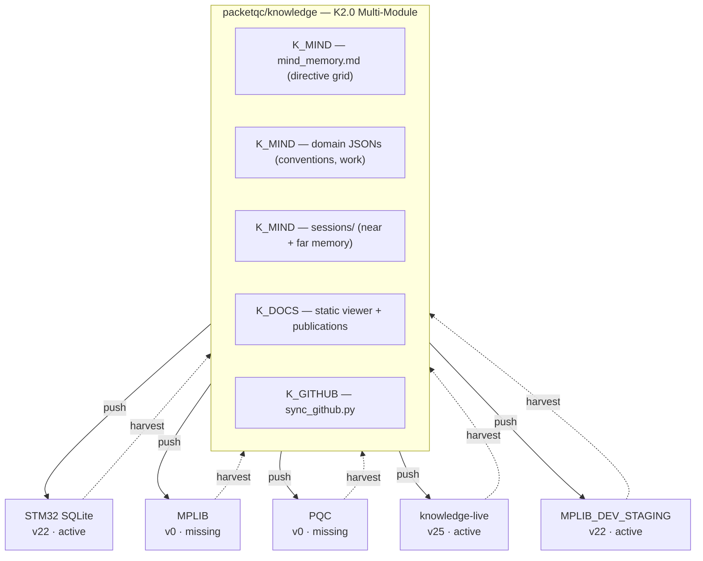
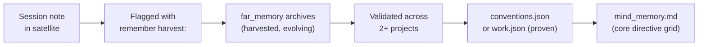

# Distributed Minds — Complete Documentation
{: #pub-title}

**Contents**

| | |
|---|---|
| [Authors](#authors) | Publication authors |
| [Abstract](#abstract) | System overview and bidirectional flow concept |
| [The Problem: Scattered Intelligence](#the-problem-scattered-intelligence) | Why multi-project AI knowledge gets lost |
| [The Solution: Bidirectional Flow](#the-solution-bidirectional-flow) | Push/harvest architecture overview |
| &nbsp;&nbsp;[Push: The Sunglasses Moment](#push-the-sunglasses-moment) | Outbound methodology delivery on wakeup |
| &nbsp;&nbsp;[Harvest: The Reverse Flow](#harvest-the-reverse-flow) | Inbound knowledge extraction from satellites |
| [Knowledge Layers](#knowledge-layers) | Core, proven, harvested, session hierarchy |
| &nbsp;&nbsp;[The Insight Lifecycle](#the-insight-lifecycle) | From session note to core knowledge |
| [Knowledge Versioning](#knowledge-versioning) | Evolution table and drift tracking |
| [First Harvest: Real Results](#first-harvest-real-results) | 15 repos crawled, 5 active satellites |
| &nbsp;&nbsp;[Network Overview](#network-overview) | Satellite status and version drift |
| &nbsp;&nbsp;[Harvested: 12 Promotion Candidates](#harvested-12-promotion-candidates) | Insights extracted from STM32, MPLIB, PQC |
| [Interactive Promotion Workflow](#interactive-promotion-workflow) | Review, stage, promote, auto-promote pipeline |
| &nbsp;&nbsp;[Severity Icons](#severity-icons) | 5-level visual health indicators |
| &nbsp;&nbsp;[Promotion Actions](#promotion-actions) | 4-action workflow per insight |
| &nbsp;&nbsp;[Healthcheck](#healthcheck) | Full network sweep command |
| [The Dashboard](#the-dashboard) | Living sub-child document with real-time status |
| [Branch Protocol & Semi-Automatic Delivery](#branch-protocol--semi-automatic-delivery) | Proxy limitations and PR-based delivery |
| &nbsp;&nbsp;[The Proxy Reality](#the-proxy-reality) | Git proxy security boundary details |
| &nbsp;&nbsp;[Why Semi-Automatic](#why-semi-automatic) | 95% autonomous, one approval click |
| &nbsp;&nbsp;[Admin Quick Routine](#admin-quick-routine--managing-claude-code-prs) | Daily PR review and batch merge guide |
| [Architecture Principles](#architecture-principles) | Core design decisions and rationale |
| [Core Principles in Publication #4](#core-principles-in-publication-4) | How #4 embodies the 12 qualities |
| [Related Publications](#related-publications) | Links to sibling publications |

## Authors

**Martin Paquet** — Network security analyst programmer, network and system security administrator, and embedded software designer and programmer who architected a distributed knowledge system where a central repository and satellite projects evolve together through bidirectional AI-assisted knowledge flow. The insight came from observing that AI coding assistants working independently across multiple projects kept rediscovering the same patterns and hitting the same pitfalls — intelligence was being generated but never consolidated.

**Claude** (Anthropic, Opus 4.6) — AI development partner operating across multiple satellite projects. Both a consumer and contributor of the distributed knowledge — reads the master mind on wakeup, evolves knowledge in satellites during work, and feeds discoveries back through harvest. This publication was itself produced through the methodology it describes.

---

## Abstract

AI coding assistants gain persistent memory through `CLAUDE.md` and `notes/` — but when an engineer works across multiple projects, each AI instance evolves independently. Patterns discovered in one project are invisible to another. Pitfalls hit in project A get hit again in project B. The collective intelligence is generated but never consolidated.

**Distributed Minds** solves this by treating Knowledge as a **living network** with bidirectional flow:

| Direction | Mechanism |
|-----------|-----------|
| **Push** (outbound) | A central knowledge repository (`packetqc/knowledge`) pushes methodology, commands, patterns, and tooling to satellite projects on every `wakeup`. |
| **Harvest** (inbound) | A new `harvest` command crawls satellite projects across all branches, extracts evolved knowledge, detects version drift, inventories knowledge distribution status, and discovers publications. |

The result is a **self-healing, version-aware, distributed intelligence network** where satellite projects are experiments and the master mind grows from all of them.

**By design**, the system only operates on repositories that the user owns and that Claude Code has been granted access to via its GitHub application configuration. No external or third-party repositories are ever accessed — the distributed intelligence network is scoped exclusively to the user's own project ecosystem. This is a deliberate security and privacy boundary.

---

## Fork & Clone Safety

This repository is public and designed to be forked. The distributed minds architecture is **owner-scoped** — all bidirectional flow is confined to the repository owner's environment:

| Concern | Protection |
|---------|-----------|
| **Credentials / tokens** | None stored anywhere — no API keys, no GitHub tokens, no secrets in files or git history |
| **Push access** | Proxy-scoped per session — a forker's Claude Code pushes only to their own fork, never to the original repo |
| **Harvest URLs** | Reference the original owner's satellites (`packetqc/<repo>`) — read-only for a forker. The harvest command cannot access repos it has no grants for |
| **`minds/` content** | Describes the original owner's satellite network — meaningless in a fork, starts fresh for a new owner |
| **Session notes** | Per-session and ephemeral — blank for every new user |

What you get by forking: **the bidirectional flow architecture, harvest protocol, promotion workflow, and dashboard template** — all intentionally public. To build your own distributed mind network, replace `packetqc` with your GitHub username in CLAUDE.md.

---

## The Problem: Scattered Intelligence

When an engineer works across multiple projects with AI assistance, intelligence is generated in every project:

| Project | What the AI learned |
|---------|---------------------|
| STM32N6570-DK_SQLITE | Page cache sizing prevents 81% throughput collapse |
| MPLIB | Multi-RTOS abstraction works with preprocessor guards |
| PQC | WolfSSL is the production PQC library for STM32, not liboqs |

But each AI instance is born fresh. Without consolidation:

| Insight | Problem |
|---------|---------|
| SQLite cache | Stays locked in the SQLite project |
| RTOS abstraction | Invisible to the SQLite project |
| PQC library choice | Has to be rediscovered in every new STM32 project |

**The knowledge is there. It's just scattered.**

---

## The Solution: Bidirectional Flow



### Push: The Sunglasses Moment

On `wakeup`, every satellite project reads `packetqc/knowledge` CLAUDE.md first. This gives the AI instance:

| Content | Description |
|---------|-------------|
| **Methodology** | How to work with the developer |
| **Proven patterns** | Embedded debugging, RTOS, SQLite, UI/backend |
| **Known pitfalls** | 12 documented failure modes |
| **Commands** | Session management, live analysis, harvest |
| **Evolution history** | What Knowledge itself has learned |

### Harvest: The Reverse Flow

The `harvest` command is the **inbound pull**:

| Step | Action |
|------|--------|
| **Crawl branches** | Enumerates all branches of a satellite repo |
| **Track cursors** | Uses per-branch commit SHA cursors (incremental) |
| **Check version** | Reads `<!-- knowledge-version: vN -->` tag |
| **Inventory distribution** | Is the satellite bootstrapped? Has notes/? Has live/? |
| **Extract knowledge** | Patterns, pitfalls, methodology, Claude instructions |
| **Detect publications** | Finds technical content worth surfacing |
| **Update dashboard** | Refreshes the living status publication |
| **Report drift** | Which features the satellite is missing |

---

## Knowledge Layers

| Layer | Location | Stability | Lifecycle |
|-------|----------|-----------|-----------|
| **Core** | `CLAUDE.md` | Stable | Rarely changes. Identity, methodology, evolution log. |
| **Proven** | `patterns/`, `lessons/`, `methodology/` | Validated | Grows when insights are promoted from minds/. |
| **Harvested** | `minds/` | Evolving | Fresh from satellite experiments. The incubator. |
| **Session** | `notes/` | Ephemeral | Per-session working memory. Rewritten daily. |

### The Insight Lifecycle



Each layer is a **filter**: session notes are raw, minds/ is curated per-project, proven/ is validated cross-project, core is the permanent record.

---

## The `#` Call Alias — Location-Independent Knowledge Routing

The `#` prefix at the beginning of a prompt is a **call alias** — it triggers scoped knowledge input mode. `#N:` routes content to publication/project N regardless of which repo the user is working in.

### How It Works

| Input | Routing | Example |
|-------|---------|---------|
| `#N: content` | Explicitly scoped to project N | `#7: fix command should prepare locally` |
| `#N:methodology:<topic>` | Methodology insight — flagged for harvest | `#7:methodology:incremental-cursors` |
| `#N:principle:<topic>` | Design principle — flagged for harvest | `#4:principle:pull-based` |
| `#0: raw dump` | Raw input — Claude classifies | `#0: whatever I have right now` |
| No `#`, in a repo | Implicit main project | Working in knowledge → implicit `#0:` |
| `#N:info` | Show accumulated knowledge for N | `#7:info` |
| `#N:done` | Compile all #N notes into summary | `#0:done` |

### Multi-Satellite Convergence

**`#N:` is the routing key, not the repo.** The same project can be documented from multiple satellites — an insight about #7 discovered while working in STM32 gets routed to #7, not to STM32's main project. Harvest pulls all `#N:` notes into `minds/`, promotion delivers them to core.

```
Satellite A ──→ harvest ──→ minds/ ──→ promotion ──→ core knowledge
Satellite B ──→ harvest ──↗
Satellite C ──→ harvest ──↗
Core direct ──────────────────────────→ notes/ ──→ core knowledge
```

### Implicit Main Project

Every repo has a main project — unscoped input goes there:

| Repo | Main project | Implicit `#` |
|------|-------------|--------------|
| `packetqc/knowledge` | #0 Knowledge | `#0:` |
| `packetqc/STM32N6570-DK_SQLITE` | #1 MPLIB Storage Pipeline | `#1:` |
| Documentation satellites | Context-dependent (multi-project) | First or declared |

This convention eliminates friction: 1 character to invoke, 3 characters to scope. The full specification is in [Publication #0 — The `#` Call Alias Convention]({{ '/publications/knowledge-system/full/#the--call-alias-convention' | relative_url }}).

---

## Knowledge Versioning

Every entry in the Knowledge Evolution table carries a version number:

| Version | Feature | Date |
|---------|---------|------|
| v1 | Session persistence | 2026-02-16 |
| v2 | Free Guy analogy | 2026-02-16 |
| v3 | Portable bootstrap | 2026-02-17 |
| v4 | Multipart help | 2026-02-17 |
| v5 | Step 0: sunglasses first | 2026-02-17 |
| v6 | Chicken-and-egg bootstrap | 2026-02-17 |
| v7 | Normalize command | 2026-02-17 |
| v8 | Profile hub | 2026-02-17 |
| v9 | Distributed minds | 2026-02-18 |
| v10 | Knowledge versioning | 2026-02-18 |
| v11 | Interactive promotion + healthcheck | 2026-02-18 |
| v12–v15 | Branch protocol exploration | 2026-02-19 |
| v16 | Save merge + cross-repo discovery | 2026-02-19 |
| v17 | Proxy reality — semi-automatic protocol | 2026-02-19 |
| v18 | `main` as convergence point | 2026-02-19 |
| v19 | Todo list must mirror full save protocol | 2026-02-19 |
| v20 | Semi-automatic delivery documentation | 2026-02-19 |
| v21 | Access scope — user-owned repos only | 2026-02-19 |
| v22 | Dual-theme webcards (Cayman + Midnight) | 2026-02-19 |
| v23 | Live knowledge network + bootstrap scaffold | 2026-02-20 |
| v24 | `refresh` command + dashboard rename | 2026-02-20 |
| v25 | Core Qualities + iterative staging | 2026-02-20 |
| v26 | `#` call alias + scoped project notes + daltonism themes | 2026-02-20 |
| v27 | Ephemeral token protocol — private repo access | 2026-02-21 |
| v28 | Proxy deep mapping + token-mediated API bypass | 2026-02-21 |
| v29 | Checkpoint/resume — crash recovery | 2026-02-21 |
| v30 | Safe elevation protocol — API crash mitigation | 2026-02-21 |
| v31 | Critical-subset satellite CLAUDE.md | 2026-02-21 |
| v32 | `recall` command + universal contextual help | 2026-02-21 |
| v33 | PAT Access Levels — 4-tier configuration | 2026-02-21 |
| v34 | Secure textarea token delivery | 2026-02-21 |
| v35 | Project as first-class entity — hierarchical indexing | 2026-02-22 |

**35 versions in 7 days.** v12–v17 trace the discovery of the proxy limitation. v18–v20 document the resulting semi-automatic architecture. v21–v25 add security boundaries, visual adaptation, live networking, lightweight recovery, and the system's 12 core qualities. v26 adds location-independent knowledge routing with the `#` call alias convention. v27–v28 introduce ephemeral token protocol and the two-channel model (git proxy vs REST API). v29–v30 add crash recovery and safe elevation. v31–v34 harden satellite CLAUDE.md, add `recall`, formalize PAT levels, and secure token delivery. v35 makes projects first-class entities with hierarchical indexing.

Satellites track their version via: `<!-- knowledge-version: v35 -->`. **Drift** = the gap between satellite and core version.

`harvest --fix` updates the satellite's tag and bootstrap section. The actual knowledge flows at wakeup — the tag just tracks awareness.

---

## First Harvest: Real Results

The first harvest crawled **15 repositories** spanning 30 years of engineering. Three key satellites were analyzed in depth:

### Network Overview

| Satellite | Language | Branches | Last Activity | Version | Drift | Bootstrap | Sessions | Publications |
|-----------|----------|----------|---------------|---------|-------|-----------|----------|--------------|
| **knowledge** (self) | Python | 4+ | 2026-02-22 | v35 | 0 | core | 9+ | 14 |
| **knowledge-live** | Python | 2 | 2026-02-20 | v25 | 0 | active | 1 | 0 |
| **STM32N6570-DK_SQLITE** | C | 2 | 2026-02-20 | v22 | 3 | active | 2 | 1 (doc/) |
| **MPLIB_DEV_STAGING** | C | 2 | 2026-02-20 | v22 | 3 | active | 1 | 0 |
| **MPLIB** | C | 1 (main) | 2025-11-19 | v0 | 25 | missing | 0 | 0 |
| **PQC** | docs only | 1 (master) | 2025-09-18 | v0 | 25 | missing | 0 | 0 |

12 additional repos (Arduino, Cisco, Java, 3D graphics, etc.) have no knowledge infrastructure and minimal harvestable content for current projects.

### Harvested: 12 Promotion Candidates

**From STM32N6570-DK_SQLITE** (3):

| | |
|---|---|
| 1 | Page cache sizing degradation (81% throughput collapse) |
| 2 | Printf latency in hot path (1-5 ms per call) |
| 3 | Slot size vs page size mismatch (memsys5) |

**From MPLIB** (3):

| | |
|---|---|
| 1 | Multi-RTOS abstraction (FreeRTOS/ThreadX with preprocessor guards) |
| 2 | CubeMX N6570-DK limitation (cannot create project from CubeMX) |
| 3 | TouchGFX MVP with backend services (extends UI/backend pattern) |

**From PQC** (6):

| | |
|---|---|
| 1 | ML-KEM/ML-DSA sizing reference (memory budgeting for embedded) |
| 2 | PQC library compliance matrix (WolfSSL = production, liboqs = dev only) |
| 3 | Flash certificate storage pattern (linker section + xxd pipeline) |
| 4 | ML-KEM/ML-DSA key sizing for constrained devices (RAM/flash budgets) |
| 5 | PQC library compliance for FIPS 203/204 (certification path) |
| 6 | Flash-resident certificate storage (linker section + xxd generation pipeline) |

### Key Finding: Partial Bootstrap — Network Growing

Two of five satellites (**STM32N6570-DK_SQLITE** and **MPLIB_DEV_STAGING**) are now bootstrapped at v22, with active sessions and knowledge infrastructure deployed. A third satellite (**knowledge-live**) is fully current at v25. Two satellites (**MPLIB** and **PQC**) remain at v0 — completely unaware of Knowledge, created before the bootstrap mechanism was established.

The network has gone from **100% drift** (all satellites unaware) to **60% bootstrapped** (3 of 5 active). `harvest --fix` continues to close the gap: remaining satellites will get their CLAUDE.md bootstrap section on next remediation pass.

---

## Interactive Promotion Workflow

### Severity Icons

| <span id="severity-icons">Icon</span> | Severity | Applied to |
|------|----------|------------|
| 🟢 | **Current / Healthy** | Drift (0), Bootstrap (active), Sessions (1+), Live (deployed), Health (reachable) |
| 🟡 | **Minor drift** | Drift (1-3), Health (stale) |
| 🟠 | **Moderate drift** | Drift (4-7) |
| 🔴 | **Critical / Missing** | Drift (8+), Bootstrap (missing), Live (missing), Health (unreachable) |
| ⚪ | **Inactive** | Sessions (0), Health (pending) |

### Promotion Actions

Each promotion candidate carries 4 action commands:

| Stage | <span id="promotion-icons">Icon</span> | Command | Effect |
|-------|------|---------|--------|
| Review | 🔍 | `harvest --review N` | Human validates — marks as reviewed |
| Stage | 📦 | `harvest --stage N <type>` | Staged for integration (lesson, pattern, methodology, docs) |
| Promote | ✅ | `harvest --promote N` | Written to core `patterns/` or `lessons/` now |
| Auto | 🔄 | `harvest --auto N` | Queued for auto-promote on next healthcheck |

On GitHub Pages, clicking an action icon copies the command to clipboard. The user pastes it into Claude Code to execute.

### Healthcheck

`harvest --healthcheck` sweeps all known satellites in a single pass:

| Step | Action |
|------|--------|
| **Crawl** | Scans each satellite (incremental) |
| **Update icons** | Refreshes severity icons in the dashboard |
| **Auto-promote** | Processes the auto-promote queue |
| **Regenerate webcards** | Regenerates #4a webcards if data changed |
| **Report** | Prints network summary |

---

## The Dashboard

This publication includes a **living sub-child document**: the [Distributed Knowledge Dashboard]({{ '/publications/distributed-knowledge-dashboard/' | relative_url }}).

The dashboard is updated on every `harvest` run with:

| Section | Content |
|---------|---------|
| **Satellite inventory** | Severity icons — first section, visible at a glance |
| **Promotion candidates** | 4-action workflow per insight |
| **Master mind status** | Current version, feature count |
| **Discovered publications** | Technical content found in satellites |

It is the network's **interactive self-awareness** — both a view and a control panel.

---

## Branch Protocol & Semi-Automatic Delivery

### The Proxy Reality

Claude Code — whether the desktop app, VS Code extension, or web interface — runs behind a **git proxy**. This proxy is a security boundary:

| Aspect | Behavior |
|--------|----------|
| **Auth token** | Held by proxy — never exposed to the sandbox |
| **Push access** | One branch only: the exact `claude/<task-id>` assigned to the session |
| **Other branches** | Pushing to any other branch — including `main` — returns HTTP 403 |
| **By design** | Intentional and documented in Claude Code's official security documentation |

This was discovered empirically through v12–v17 of the knowledge evolution:

| Version | What was believed | What was true |
|---------|-------------------|---------------|
| v12–v15 | Claude Code can push to any `claude/*` branch autonomously | Only the assigned task branch |
| v16 | Within-repo merge to a shared branch would work | 403 on any non-assigned branch |
| v17 | Discovered: the proxy is per-branch AND per-repo scoped | Confirmed across all environments |

**Official documentation** ([code.claude.com/docs/en/security](https://code.claude.com/docs/en/security)):
> "Branch restrictions: Git push operations are restricted to the current working branch"

**Key GitHub issues**:

| Issue | Description |
|-------|-------------|
| [#22636](https://github.com/anthropics/claude-code/issues/22636) | Push to main blocked even with explicit approval (open, stale) |
| [#11153](https://github.com/anthropics/claude-code/issues/11153) | 403 errors on push (closed NOT_PLANNED — intentional) |
| [#10018](https://github.com/anthropics/claude-code/issues/10018) | Start from non-default branch (open, 70+ upvotes) |

### Why Semi-Automatic

Since Claude Code cannot push directly to `main`, every delivery goes through a **pull request**:

```
Claude (autonomous)              User (one click)
─────────────────                ────────────────
1. Work on task branch
2. Commit changes
3. Push to task branch
4. Create PR → main
                                 5. Review & approve PR
                                 6. Merge lands on main
                                 7. GitHub Pages auto-deploys
```

Claude does **95% of the work** autonomously. The user provides **one approval click** — the security gate that crosses the sandbox boundary.

### Branch Roles

Only two branch types exist:

| Branch | Role | Who writes | How |
|--------|------|------------|-----|
| `main` | **Convergence point** — all work accumulates here | PR merges (user-approved) | Semi-automatic |
| `claude/<task-id>` | **Task branches** — per-session, ephemeral | Claude Code (proxy-authorized push) | Automatic |

### What Claude Code CAN and CANNOT Do

| Action | Allowed | Mechanism |
|--------|---------|-----------|
| Push to assigned task branch | Yes | Proxy-authorized |
| Create PRs targeting any branch | Yes | `gh pr create` |
| Read any branch (fetch/clone) | Yes | Public HTTPS |
| Push to `main` | **No** | 403 — proxy blocks |
| Push to other `claude/*` branches | **No** | 403 — scoped to assigned only |
| Push to branches in other repos | **No** | 403 — per-repo scoped |
| GitHub REST API (with token) | **Yes** | Direct to api.github.com — bypasses proxy |

### The Two-Channel Model (v28)

Empirical testing revealed that git operations and API operations use different channels:

| Channel | Route | Auth | Cross-repo |
|---------|-------|------|------------|
| **Git** | Local proxy (`127.0.0.1:<port>`) | Proxy-managed, per-repo | ❌ Blocked |
| **API** | Direct to `api.github.com` | Token-authenticated (ephemeral) | ✅ Unrestricted |

**Without token**: each satellite needs its own Claude Code session. **With token**: a single session can orchestrate the entire network via API — create PRs, merge them, manage branches on any repo the token has access to. The git proxy is the sandbox; the REST API is the escape hatch.

### Admin Quick Routine — Managing Claude Code PRs

Simple routine for the project administrator to manage the semi-automatic workflow:

**Daily PR Review (2-3 minutes)**

```
Step 1 — Open GitHub notifications or repo PR list
         https://github.com/packetqc/<repo>/pulls

Step 2 — For each open PR from claude/* branches:
         • Read the PR title and summary (Claude writes these)
         • Check the diff tab for changes
         • If good → click "Merge pull request" → "Confirm merge"
         • If needs work → comment on the PR, address in next session

Step 3 — Delete merged branches (GitHub offers this automatically)
```

**Batch Merge (when multiple PRs accumulate)**

```bash
# Review all open PRs at once
gh pr list --state open

# Quick-merge a specific PR
gh pr merge <PR-number> --merge --delete-branch

# Quick-merge all Claude PRs (review first!)
gh pr list --state open --json number \
  | jq '.[].number' \
  | xargs -I {} gh pr merge {} --merge --delete-branch
```

**Conflict Resolution**

When two Claude sessions modify the same file:

| Step | Action |
|------|--------|
| **1** | Merge the first PR normally |
| **2** | The second PR shows a conflict |
| **3** | Resolve in GitHub's web editor, checkout locally, or start a new Claude session to resolve |

**Tips**

| Practice | Rationale |
|----------|-----------|
| **Merge often** | Don't let PRs accumulate — each is small and focused |
| **Delete branches after merge** | Keeps the repo clean |
| **One session = one PR** | Each Claude Code session creates one task branch and one PR |
| **Save protocol = PR creation** | Every `save` ends with a PR. No PR = stranded work |

---

## Architecture Principles

| Principle | Description |
|-----------|-------------|
| **Satellites are experiments, core is the record** | Projects come and go. The knowledge they generate outlives the project through harvest and promotion. |
| **Version tracks awareness, not content** | A satellite at v25 doesn't contain all v25 features locally. It just knows where to read them. The version tag prevents stale pointers. |
| **Harvest is incremental** | Branch cursors (commit SHAs) mean the second harvest only scans new commits. |
| **Publications stay in their source** | When harvest detects a publication in a satellite, it copies the **reference** (title, path, summary), not the content. The original stays in the satellite. |
| **Promotion requires cross-project validation** | An insight in `minds/` is a hypothesis. When the same pattern appears in 2+ projects, it's validated. Only then does it graduate to core. |
| **User-owned repos with Claude Code access only** | The system only operates on repositories that the user owns and that Claude Code has been granted access to. No external or third-party repositories are ever accessed — the distributed intelligence network is scoped exclusively to the user's own project ecosystem. |

---

## Core Principles in Publication #4

Knowledge embodies 12 core qualities. Publication #4 primarily manifests four:

| Principle | How #4 embodies it |
|-----------|-------------------|
| **Distributed** | The entire architecture — push/harvest bidirectional flow between master and satellites — is distribution by design. Intelligence flows outward on wakeup, inward on harvest. |
| **Evolutionary** | 35 versions in 7 days. The knowledge versioning system, drift detection, and promotion pipeline ensure the network evolves continuously. Each harvest grows the master mind. |
| **Recursive** | The system documents itself by consuming its own output. This publication was harvested from the very methodology it describes. The dashboard updates itself on every harvest run. |
| **Concise** | The `#` call alias convention — 1 character to invoke, 3 characters to scope (`#N:`), 0 characters for implicit main project. Maximum signal, minimum friction. See [Publication #0 — The `#` Call Alias Convention]({{ '/publications/knowledge-system/full/#the--call-alias-convention' | relative_url }}). |

The remaining 8 qualities (*self-sufficient*, *autonomous*, *concordant*, *interactive*, *persistent*, *secure*, *resilient*, *structured*) are present throughout — but *distributed*, *evolutionary*, *recursive*, and *concise* are the DNA of Distributed Minds.

---

## Related Publications

| # | Publication | Relationship |
|---|-------------|-------------|
| 0 | [Knowledge]({{ '/publications/knowledge-system/' | relative_url }}) | Master publication — the system this architecture serves |
| 1 | [MPLIB Storage Pipeline]({{ '/publications/mplib-storage-pipeline/' | relative_url }}) | First satellite — source of embedded patterns now in core |
| 2 | [Live Session Analysis]({{ '/publications/live-session-analysis/' | relative_url }}) | Live tooling synced outbound from core to satellites |
| 3 | [AI Session Persistence]({{ '/publications/ai-session-persistence/' | relative_url }}) | Foundation — the session memory that makes harvest possible |
| 4a | [Knowledge Dashboard]({{ '/publications/distributed-knowledge-dashboard/' | relative_url }}) | Living sub-child — real-time network status |
| 5 | [Webcards & Social Sharing]({{ '/publications/webcards-social-sharing/' | relative_url }}) | Visual identity — dual-theme animated previews for the network |
| 6 | [Normalize & Structure Concordance]({{ '/publications/normalize-structure-concordance/' | relative_url }}) | Self-healing — structural integrity enforcement across docs |
| 7 | [Harvest Protocol]({{ '/publications/harvest-protocol/' | relative_url }}) | Practical companion — the harvest command specification |
| 8 | [Session Management]({{ '/publications/session-management/' | relative_url }}) | Practical companion — wakeup/save/refresh lifecycle |
| 9 | [Security by Design]({{ '/publications/security-by-design/' | relative_url }}) | Security architecture — access scope, fork safety, proxy model |
| 9a | [Token Lifecycle Compliance]({{ '/publications/security-by-design/compliance/' | relative_url }}) | Compliance — OWASP, NIST, FIPS assessment |
| 10 | [Live Knowledge Network]({{ '/publications/live-knowledge-network/' | relative_url }}) | Next evolution — PQC-secured inter-instance communication |
| 11 | [Success Stories]({{ '/publications/success-stories/' | relative_url }}) | Validation — demonstrated capabilities |

---

*Authors: Martin Paquet & Claude (Anthropic, Opus 4.6)*
*Knowledge: [packetqc/knowledge](https://github.com/packetqc/knowledge)*
