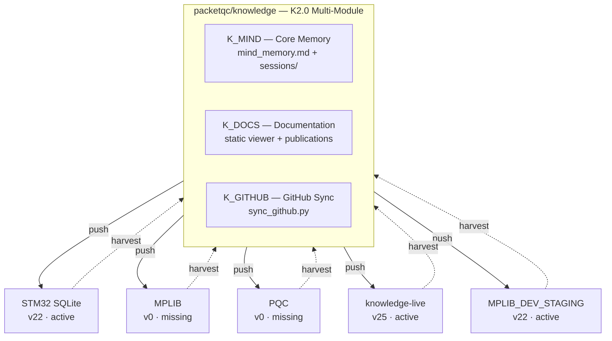

# Distributed Minds — Bidirectional Knowledge Flow for AI-Assisted Multi-Project Engineering
{: #pub-title}

**Contents**

| | |
|---|---|
| [Abstract](#abstract) | Distributed intelligence network overview |
| [The Bidirectional Flow](#the-bidirectional-flow) | Push methodology out, harvest knowledge back |
| [Knowledge Layers](#knowledge-layers) | Core, proven, harvested, session hierarchy |
| [First Harvest Results](#first-harvest-results) | 5 satellites, 12 promotion candidates |
| [Interactive Promotion Workflow](#interactive-promotion-workflow) | Review, stage, promote pipeline |
| [Branch Protocol & Semi-Automatic Delivery](#branch-protocol--semi-automatic-delivery) | Proxy reality and two-channel model |
| [Sub-Child: Living Dashboard](#sub-child-living-dashboard) | Real-time network status document |

## Abstract

AI coding assistants gain persistent memory through `CLAUDE.md` and `notes/` — but when working across multiple projects, each instance evolves independently. Intelligence is generated everywhere but consolidated nowhere.

**Distributed Minds** creates a living network: a master mind pushes methodology to satellites on wakeup, and `harvest` pulls evolved knowledge back. The result is a self-healing, version-aware distributed intelligence.

**By design**, the system only operates on repositories that the user owns and that Claude Code has been granted access to via its GitHub application configuration. No external or third-party repositories are ever accessed.

## The Bidirectional Flow

| Direction | Mechanism | Content |
|-----------|-----------|---------|
| **Push** (outbound) | `wakeup` reads core CLAUDE.md | Methodology, patterns, pitfalls, commands |
| **Harvest** (inbound) | `harvest <project>` crawls branches | Evolved patterns, new pitfalls, publications |

## Knowledge Layers

| Layer | Stability | Purpose |
|-------|-----------|---------|
| **Core** (CLAUDE.md) | Stable | Identity, methodology, evolution log |
| **Proven** (patterns/, lessons/) | Validated | Battle-tested across 2+ projects |
| **Harvested** (minds/) | Evolving | Fresh from satellite experiments |
| **Session** (notes/) | Ephemeral | Per-session working memory |

## First Harvest Results

15 repositories crawled. 5 satellites in the active network:

| Satellite | Version | Drift | Bootstrap | Sessions | Promotion Candidates |
|-----------|---------|-------|-----------|----------|---------------------|
| knowledge (self) | v25 | 0 | core | 9+ | 12 publications |
| knowledge-live | v25 | 0 | active | 1 | — |
| STM32N6570-DK_SQLITE | v22 | 3 behind | active | 2 | 3 (cache sizing, printf latency, slot mismatch) |
| MPLIB_DEV_STAGING | v22 | 3 behind | active | 1 | — |
| MPLIB | v0 | 25 behind | missing | 0 | 3 (multi-RTOS, CubeMX limitation, TouchGFX MVP) |
| PQC | v0 | 25 behind | missing | 0 | 6 (ML-KEM sizing, library compliance, flash certs, key sizing, FIPS compliance, cert storage) |

**12 promotion candidates** harvested. **60% bootstrapped** (3 of 5 satellites active) — network growing from initial 100% drift.

## Interactive Promotion Workflow

Harvested insights advance through 4 stages, driven from the dashboard:

| Stage | Icon | Action |
|-------|------|--------|
| Review | 🔍 | `harvest --review N` — human validates |
| Stage | 📦 | `harvest --stage N <type>` — queued for integration |
| Promote | ✅ | `harvest --promote N` — written to core now |
| Auto | 🔄 | `harvest --auto N` — auto-promote on next healthcheck |

Dashboard severity icons: 🟢 current — 🟡 minor drift — 🟠 moderate — 🔴 critical — ⚪ inactive

`harvest --healthcheck` sweeps all satellites, updates the dashboard, and processes auto-promotes.

## Branch Protocol & Semi-Automatic Delivery

Claude Code runs behind a **git proxy** that restricts push access to the exact assigned `claude/<task-id>` branch only. Pushing to `main` or any other branch returns HTTP 403. This is intentional — documented in Claude Code's official security docs.

The result is a **semi-automatic** delivery protocol:

| Step | Who | Action |
|------|-----|--------|
| 1–4 | Claude (autonomous) | Work, commit, push to task branch, create PR |
| 5 | User (one click) | Review and approve PR → merge lands on `main` |

**Two branch types only**: `main` (convergence, PR-gated) and `claude/<task-id>` (ephemeral, per-session).

**Two-channel model (v28)**: Git operations go through the proxy (restricted). GitHub REST API goes direct (unrestricted with token). With a valid ephemeral token, a single session can orchestrate the entire network via API — creating PRs, merging them, managing branches across all repos.

**Admin routine**: Review open PRs daily (2-3 min), merge with one click, delete branches. Use `gh pr merge` for batch operations. See the [full documentation]({{ '/publications/distributed-minds/full/' | relative_url }}) for the complete admin guide.

## The `#` Call Alias — Knowledge Routing

The `#` call alias (v26) adds **location-independent routing** to the distributed mind. `#N:` scopes any note to a publication/project regardless of which repo the user is working in.

| Input | Routing |
|-------|---------|
| `#N: content` | Scoped to project N |
| `#0: raw dump` | Raw input — Claude classifies |
| No `#`, in repo | Implicit main project |
| `#N:info` | Show accumulated knowledge |
| `#N:done` | Compile notes into summary |

**Multi-satellite convergence**: Same project documented from multiple satellites — `#N:` is the routing key, not the repo. Harvest pulls all `#N:` notes into `minds/`, promotion converges into core. See [Publication #0 — The `#` Call Alias Convention]({{ '/publications/knowledge-system/full/#the--call-alias-convention' | relative_url }}).

## Sub-Child: Living Dashboard

The [Knowledge Dashboard]({{ '/publications/distributed-knowledge-dashboard/' | relative_url }}) is a living document updated on every `harvest` run — an interactive control panel for the distributed intelligence.

---

[**Read the full documentation →**]({{ '/publications/distributed-minds/full/' | relative_url }})

---

*Authors: Martin Paquet & Claude (Anthropic, Opus 4.6)*
*Knowledge: [packetqc/knowledge](https://github.com/packetqc/knowledge)*
