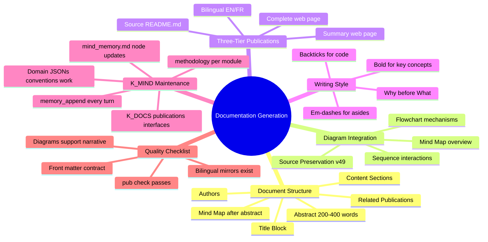

# Documentation Generation Methodology — Complete Documentation
{: #pub-title}

> **Summary**: [Publication #18]({{ '/publications/documentation-generation/' | relative_url }}) | **Parent**: [#0 — Knowledge System]({{ '/publications/knowledge-system/' | relative_url }}) | **Core reference**: [#14 — Architecture Analysis]({{ '/publications/architecture-analysis/' | relative_url }}) | [#0v2 — Knowledge 2.0]({{ '/publications/knowledge-2.0/' | relative_url }})

**Contents**

| | |
|---|---|
| [Abstract](#abstract) | The methodology of methodologies |
| [The Problem](#the-problem) | Implicit conventions lost after compaction |
| [The Solution](#the-solution) | Codified standards with universal inheritance |
| [Source Document Structure](#1-source-document-structure) | Standard section order |
| [Mind Map Standard](#2-mind-map-standard) | Placement, conventions, reusability |
| [Diagram Integration](#3-diagram-integration-rules) | Type selection, styling, source preservation |
| [Three-Tier Structure](#4-three-tier-publication-structure) | Source → Summary → Complete |
| [Writing Style](#5-writing-style-conventions) | Formatting, references, tone |
| [Core Qualities](#6-core-qualities-alignment) | How the 13 qualities are enforced |
| [Universal Inheritance](#7-universal-inheritance) | Essential files update checklist |
| [Quality Checklist](#8-quality-checklist) | 13-point pre-delivery validation |
| [Impact](#impact) | What this changes |
| [Design Principles](#design-principles) | What we learned |

---

## Abstract

Every publication in the Knowledge system follows patterns that evolved organically through practice: mind maps after abstracts, three-tier structure (source → summary → complete), bilingual mirroring, diagram integration, and essential files updates. These patterns were never formally documented — they lived implicitly in the accumulated experience of 17 publications and 49 knowledge versions.

This publication is **the methodology of methodologies** — it codifies the documentation generation standards that every other methodology inherits. When Claude generates a publication, creates a methodology file, or delivers any documentation artifact, these are the conventions it follows.

The key insight is **universal inheritance**: every methodology-specific operation (publication creation, K_GITHUB sync, project scaffolding, structural fixes) inherits the obligation to update the system's essential files — `NEWS.md`, `PLAN.md`, `LINKS.md`, `mind_memory.md + domain JSONs`, `STORIES.md`, `publications/README.md`, publication indexes, and profile pages. One command = work + essential files + delivery.

---

## The Problem

Through 17 publications and 49 knowledge versions, the system developed consistent documentation patterns — but they were never written down. New Claude instances would read `mind_memory.md` and learn the directives and protocols, but the *documentation generation conventions* (how to write abstracts, when to use which diagram type, what files to update after each delivery) were absorbed implicitly through example.

This created two risks:
1. **Inconsistency after compaction** — After context window compaction, the implicit conventions were lost. Mind maps disappeared from new publications. Essential files weren't updated. The quality dropped.
2. **No onboarding path** — A new methodology couldn't inherit standards that didn't exist in writing. Each methodology reinvented its own documentation conventions instead of inheriting from a universal parent.

---

## The Solution

A formal meta-methodology (`methodology/documentation-generation.md`) that codifies:

### 1. Source Document Structure

Every publication source follows a standard section order:

| Order | Section | Purpose |
|-------|---------|---------|
| 1 | **Title Block** | Publication ID, version, date, language toggle |
| 2 | **Authors** | Role descriptions specific to this publication |
| 3 | **Abstract** | 200-400 words, "why" before "what" |
| 4 | **Mind Map** | Visual summary — always after abstract, always present |
| 5 | **Context / Problem** | The engineering need that triggered this work |
| 6 | **Solution / Mechanism** | How it works — architecture, protocol, approach |
| 7 | **Implementation** | Deep dives, code, workflows, examples |
| 8 | **Results / Impact** | Measured outcomes, real data |
| 9 | **Design Principles** | What we learned, what principles emerged |
| 10 | **Related Publications** | Cross-references to siblings and parents |

### 2. Mind Map Standard

**Every publication includes a mind map diagram immediately after the abstract.** This is the reader's first visual anchor:

- Root node: publication title or core concept
- First-level: 3-6 main topics covered
- Second-level: key details per topic (2-3 each)
- Maximum ~25 total nodes for scannability
- Present in ALL three tiers (source, summary, complete)
- Reusable: dashboards, presentations, cross-references

### 3. Diagram Integration Rules

| Position in document | Diagram type | Purpose |
|---------------------|-------------|---------|
| After abstract | `mindmap` | Document scope overview |
| Problem section | `flowchart` | Visualize the issue |
| Solution section | `flowchart` / `graph` | Show the mechanism |
| Process sections | `sequenceDiagram` | Step-by-step flow |
| Data sections | `gantt` / `xychart` | Timeline or metrics |
| Architecture | `graph TB/LR` | Component relationships |

**Mermaid type selection**:

| Type | Best for | Direction |
|------|----------|-----------|
| `mindmap` | Topic overview, document summary | Radial |
| `flowchart TB` | Hierarchies, data flow | Top-down |
| `flowchart LR` | Pipelines, processes | Left-to-right |
| `graph TB/LR` | General architecture, DAG | Either |
| `sequenceDiagram` | Interactions, API calls | Time-based |
| `gantt` | Timelines, phases | Chronological |

**Source preservation (v49)**: When diagrams are pre-rendered to images, the Mermaid source MUST be preserved in a `
` block. The image is the artifact; the source is the truth.

### 4. Three-Tier Publication Structure

| Tier | File | Content scope |
|------|------|--------------|
| **Source** | `publications/<slug>/v1/README.md` | Full canonical content |
| **Summary** | `docs/publications/<slug>/index.md` | Abstract + mind map + key highlights + link to complete |
| **Complete** | `docs/publications/<slug>/full/index.md` | Full documentation on GitHub Pages |

**Sync direction**: Source → Complete (full content, web-adapted). Source → Summary (curated overview, not truncated). Mind map present in all three.

**Bilingual**: Every web page has an EN/FR mirror. Technical identifiers stay English. Narrative text is translated.

### 5. Writing Style Conventions

| Convention | When | Example |
|------------|------|---------|
| **Bold** | First mention of key concept | **Distributed Minds** architecture |
| *Italics* | Analogy, metaphor, quality names | the *persistent* quality |
| `Backticks` | Code, files, commands, branches | `K_GITHUB sync + /integrity-check` |
| Em-dash (—) | Parenthetical detail | the system — designed for autonomy — adapts |
| `#N` | Publication reference | Publication #7 (Harvest Protocol) |

**Tone**: Technical but narrative-driven. Frame "why" before "what". Avoid jargon without context.

### 6. Core Qualities Alignment

Every documentation convention reinforces the system's **13 core qualities** — the vital design principles that Knowledge was built on:

| Quality | How documentation generation enforces it |
|---------|----------------------------------------|
| **Autosuffisant** | Zero external dependencies — plain markdown in Git |
| **Autonome** | Self-operating pipeline — `pub new` → `pub sync` → `pub check` |
| **Concordant** | EN/FR mirrors, front matter validation, three-tier sync |
| **Concis** | Curated summaries, not truncated copies; mind maps for scope |
| **Interactif** | Reusable mind maps, click-to-copy commands, severity icons |
| **Évolutif** | Each publication captures a real discovery — the system grows |
| **Distribué** | Satellites produce publications; K_GITHUB sync pulls them to core |
| **Persistant** | Versioned source; derived web pages; knowledge survives sessions |
| **Récursif** | This publication documents the methodology that produced it |
| **Sécuritaire** | No credentials; fork-safe; owner-scoped URLs |
| **Résilient** | Three tiers = redundancy; `pub check` catches drift |
| **Structuré** | Standard section order, front matter contract, P#/S#/D# indexing |
| **Intégré** | Publications feed Issues, boards, and webcards — extending into platforms |

These are the DNA of the knowledge system. Every methodology inherits them by inheritance from this meta-methodology. Every documentation artifact that follows these conventions automatically embodies the 13 qualities.

### 7. Universal Inheritance

**Every methodology inherits this obligation.** When any operation produces changes:

| File | Update when | What |
|------|------------|------|
| `NEWS.md` | Any deliverable | New changelog entry |
| `PLAN.md` | New feature/capability | What's New or Ongoing section |
| `LINKS.md` | New web page URL | Add to Essentials or Hubs; update page counts |
| `mind_memory.md + domain JSONs` | New publication/module/evolution | Mindmap nodes, conventions.json, work.json |
| `STORIES.md` | New success story | Add to Stories Index with category and date |
| `publications/README.md` | New publication | Add entry to master Publication Index |
| Publication indexes (EN/FR) | New publication | Add entry to both |
| Profile pages (6) | New publication | Add to all 6 profile pages — lower priority, can be batched |

**The inheritance principle**: every methodology file in `methodology/` is a child of this meta-methodology. When a methodology-specific operation runs (`pub new`, domain JSON update, `project create`, `K_VALIDATION /normalize --fix`), it inherits the universal checklist.

### 8. Quality Checklist

Before delivering any publication:

- [ ] All front matter fields present (`layout`, `title`, `description`, `pub_id`, `version`, `date`, `permalink`, `og_image`, `keywords`)
- [ ] Abstract: 200-400 words, answers "why" + "what"
- [ ] Mind map: present after abstract in all three tiers
- [ ] Diagrams: support the narrative, not decorative
- [ ] Tables: markdown pipes, bold headers, consistent format
- [ ] Three tiers: source + summary + complete
- [ ] Bilingual mirrors: EN + FR for all web pages
- [ ] Webcard: generated (or placeholder) and `og_image` set
- [ ] Essential files: NEWS.md, PLAN.md, LINKS.md, STORIES.md evaluated for update
- [ ] mind_memory.md + domain JSONs: Mindmap nodes and module JSONs updated
- [ ] publications/README.md: Master index updated
- [ ] Publication indexes: EN/FR both updated
- [ ] Cross-references: sibling publications linked
- [ ] `pub check` passes

---

## Impact

### What This Changes

| Before | After |
|--------|-------|
| Conventions absorbed implicitly by example | Conventions codified and inheritable |
| Mind maps appeared sometimes, not always | Mind map standard: always after abstract |
| Essential files updated inconsistently | Universal inheritance: every methodology checks NEWS/PLAN/LINKS |
| New methodologies reinvented structure | New methodologies inherit from meta-methodology |
| Quality depended on context window state | Quality checklist survives compaction |
| Core qualities were implicit in practice | Core qualities explicitly mapped to documentation conventions |

### Design Principles

1. **Codify, don't memorize** — If a pattern repeats 3+ times, it belongs in the methodology, not in session memory
2. **Inherit, don't duplicate** — Every methodology inherits universal obligations from this parent
3. **Mind map first** — The visual summary is the reader's entry point, not an afterthought
4. **Source is truth** — Source README.md drives all downstream artifacts (web pages, PDFs, diagrams)
5. **One command, complete delivery** — Work + essential files + commit + push + PR = one atomic operation
6. **Qualities are DNA** — The 13 core qualities are not aspirational — they are enforced by convention

---

## Related Publications

| # | Publication | Relationship |
|---|-------------|-------------|
| 0 | [Knowledge System]({{ '/publications/knowledge-system/' | relative_url }}) | Parent — #18 codifies #0's documentation generation |
| 5 | [Webcards & Social Sharing]({{ '/publications/webcards-social-sharing/' | relative_url }}) | Webcard design conventions |
| 6 | [Normalize & Structure Concordance]({{ '/publications/normalize-structure-concordance/' | relative_url }}) | Structure concordance enforcement |
| 13 | [Web Pagination & Export]({{ '/publications/web-pagination-export/' | relative_url }}) | PDF/DOCX export pipeline |
| 16 | [Web Page Visualization]({{ '/publications/web-page-visualization/' | relative_url }}) | Local rendering pipeline |
| 17 | [Web Production Pipeline]({{ '/publications/web-production-pipeline/' | relative_url }}) | Jekyll processing chain |
| 14 | [Architecture Analysis]({{ '/publications/architecture-analysis/' | relative_url }}) | Multi-module architecture design |
| 0v2 | [Knowledge 2.0]({{ '/publications/knowledge-2.0/' | relative_url }}) | K2.0 multi-module architecture reference |

**Source**: [Issue #355](https://github.com/packetqc/knowledge/issues/355) — Documentation generation methodology session.

---

*Authors: Martin Paquet & Claude (Anthropic, Opus 4.6)*
*Knowledge: [packetqc/knowledge](https://github.com/packetqc/knowledge)*
