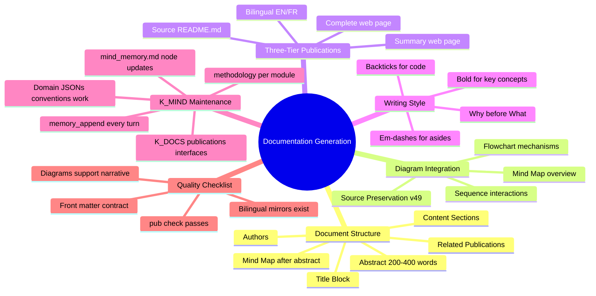

# Documentation Generation Methodology
{: #pub-title}

> **Parent publication**: [#0 — Knowledge System]({{ '/publications/knowledge-system/' | relative_url }}) | **Structure companion**: [#6 — Normalize]({{ '/publications/normalize-structure-concordance/' | relative_url }}) | **Pipeline companion**: [#17 — Web Production Pipeline]({{ '/publications/web-production-pipeline/' | relative_url }})

**Contents**

| | |
|---|---|
| [Abstract](#abstract) | The methodology of methodologies |
| [The Problem](#the-problem) | Implicit conventions lost after compaction |
| [The Solution](#the-solution) | Codified standards with universal inheritance |
| [Core Qualities](#core-qualities-alignment) | How documentation enforces the 13 qualities |
| [Full Documentation](#full-documentation) | Complete meta-methodology reference |

## Abstract

Every publication in the Knowledge system follows patterns that evolved organically through practice: mind maps after abstracts, three-tier structure (source → summary → complete), bilingual mirroring, diagram integration, and essential files updates. These patterns were never formally documented — they lived implicitly in the accumulated experience of 17 publications and 49 knowledge versions.

This publication is **the methodology of methodologies** — it codifies the documentation generation standards that every other methodology inherits. When Claude generates a publication, creates a methodology file, or delivers any documentation artifact, these are the conventions it follows.

The key insight is **universal inheritance**: every methodology-specific operation (publication creation, harvest promotion, project scaffolding, structural fixes) inherits the obligation to update the system's essential files — `NEWS.md`, `PLAN.md`, `LINKS.md`, `CLAUDE.md`, `STORIES.md`, `publications/README.md`, publication indexes, and profile pages. One command = work + essential files + delivery.

The [complete documentation]({{ '/publications/documentation-generation/full/' | relative_url }}) covers all sections with detailed specifications.

## The Problem

Through 17 publications and 49 knowledge versions, the system developed consistent documentation patterns — but they were never written down. New Claude instances would read `CLAUDE.md` and learn the commands and protocols, but the *documentation generation conventions* were absorbed implicitly through example.

This created two risks:
1. **Inconsistency after compaction** — After context window compaction, the implicit conventions were lost. Mind maps disappeared. Essential files weren't updated. Quality dropped.
2. **No onboarding path** — A new methodology couldn't inherit standards that didn't exist in writing.

## The Solution

A formal meta-methodology (`methodology/documentation-generation.md`) that codifies:

| Standard | What it defines |
|----------|----------------|
| **Source Document Structure** | 10-section order: title → authors → abstract → mind map → content → related |
| **Mind Map Standard** | Always present after abstract, in all three tiers, 3-6 first-level nodes |
| **Diagram Integration** | Type selection per position: mindmap → flowchart → sequence → gantt |
| **Three-Tier Structure** | Source → Summary → Complete, with bilingual EN/FR mirrors |
| **Writing Style** | Bold for concepts, backticks for code, em-dashes for asides, "why" before "what" |
| **Universal Inheritance** | Every methodology updates NEWS.md, PLAN.md, LINKS.md, CLAUDE.md, indexes |
| **Quality Checklist** | 13-point validation before any delivery |

## Core Qualities Alignment

Every documentation convention reinforces the system's **13 core qualities**:

| Quality | How documentation enforces it |
|---------|------------------------------|
| **Autosuffisant** | Zero external dependencies — plain markdown in Git |
| **Autonome** | Self-operating pipeline — `pub new` → `pub sync` → `pub check` |
| **Concordant** | EN/FR mirrors, front matter validation, three-tier sync |
| **Concis** | Curated summaries, not truncated copies; mind maps for scope |
| **Interactif** | Reusable mind maps, click-to-copy commands, severity icons |
| **Évolutif** | Each publication captures a real discovery |
| **Distribué** | Satellites produce publications; harvest pulls them to core |
| **Persistant** | Versioned source; derived web pages; knowledge survives sessions |
| **Récursif** | This publication documents the methodology that produced it |
| **Sécuritaire** | No credentials; fork-safe; owner-scoped URLs |
| **Résilient** | Three tiers = redundancy; `pub check` catches drift |
| **Structuré** | Standard section order, front matter contract, P#/S#/D# indexing |
| **Intégré** | Publications feed Issues, boards, and webcards |

## Full Documentation

The [complete documentation]({{ '/publications/documentation-generation/full/' | relative_url }}) includes all sections:

| Section | What it covers |
|---------|---------------|
| Source Document Structure | Standard section order for all publications |
| Mind Map Standard | Placement, conventions, reusability |
| Diagram Integration | Type selection, styling, source preservation |
| Three-Tier Structure | Source → Summary → Complete split |
| Writing Style | Formatting conventions, reference format, tone |
| Core Qualities | How 13 qualities are enforced by documentation |
| Universal Inheritance | Essential files update checklist |
| Quality Checklist | 13-point pre-delivery validation |

**Source**: [Issue #355](https://github.com/packetqc/knowledge/issues/355) — Documentation generation methodology session.

---

## Related Publications

| # | Publication | Relationship |
|---|-------------|-------------|
| 0 | [Knowledge System]({{ '/publications/knowledge-system/' | relative_url }}) | Parent — #18 codifies #0's documentation generation |
| 5 | [Webcards & Social Sharing]({{ '/publications/webcards-social-sharing/' | relative_url }}) | Webcard design conventions |
| 6 | [Normalize & Structure Concordance]({{ '/publications/normalize-structure-concordance/' | relative_url }}) | Structure concordance enforcement |
| 13 | [Web Pagination & Export]({{ '/publications/web-pagination-export/' | relative_url }}) | PDF/DOCX export pipeline |
| 16 | [Web Page Visualization]({{ '/publications/web-page-visualization/' | relative_url }}) | Local rendering pipeline |
| 17 | [Web Production Pipeline]({{ '/publications/web-production-pipeline/' | relative_url }}) | Jekyll processing chain |

---

*Authors: Martin Paquet & Claude (Anthropic, Opus 4.6)*
*Knowledge: [packetqc/knowledge](https://github.com/packetqc/knowledge)*
