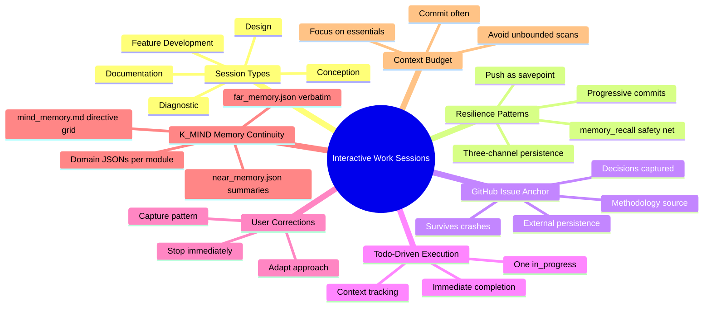

# Interactive Work Sessions
{: #pub-title}

> **Parent publication**: [#0 — Knowledge System]({{ '/publications/knowledge-system/' | relative_url }}) | **Session companion**: [#8 — Session Management]({{ '/publications/session-management/' | relative_url }}) | **Standards companion**: [#18 — Documentation Generation]({{ '/publications/documentation-generation/' | relative_url }}) | **Core reference**: [#14 — Architecture Analysis]({{ '/publications/architecture-analysis/' | relative_url }}) | [#0v2 — Knowledge 2.0]({{ '/publications/knowledge-2.0/' | relative_url }})

**Contents**

| | |
|---|---|
| [Abstract](#abstract) | Resilient multi-delivery sessions |
| [Five Session Types](#five-interactive-session-types) | Diagnostic, documentation, conception, design, feature development |
| [Three-Channel Persistence](#three-channel-persistence) | Git + GitHub Issues + Essential files |
| [Progressive Commits](#progressive-commit-protocol) | Savepoints that survive crashes |
| [Full Documentation](#full-documentation) | Complete methodology reference |

## Abstract

Interactive work sessions are the **operational heartbeat** of the Knowledge system. Every publication, methodology, feature, and architectural discovery was produced during an interactive session between Martin and Claude. Yet the patterns that make these sessions productive — progressive commits, GitHub issue anchoring, user correction integration, context budget management — were never formally documented.

This publication codifies the methodology for **resilient, multi-delivery interactive sessions**. The key insight is **three-channel persistence**: work survives through Git branches (commits + pushes), GitHub Issues (external persistence), and essential files (NEWS.md, PLAN.md, etc.). When all three channels are active, even a catastrophic session crash loses at most the current in-progress todo — not the entire session's work.

The methodology recognizes **five interactive session types**, each with its own phase pattern and dedicated methodology file: diagnostic (hypothesis → elimination → fix), documentation (gather → structure → mirror), conception (ideate → prototype → validate), design (explore → propose → build), and feature development (analyze → implement → integrate). All types inherit the same resilience patterns.



## Five Interactive Session Types

| Type | Trigger | Phase pattern | Methodology |
|------|---------|---------------|-------------|
| **Diagnostic** | Bug report, rendering issue | Hypothesis → elimination → isolation → fix | `interactive-diagnostic.md` |
| **Documentation** | New publication, methodology | Gather → structure → expand → web pages → deliver | `interactive-documentation.md` |
| **Conception** | New idea, architecture exploration | Ideate → prototype → user feedback → formalize | `interactive-conception.md` |
| **Design** | New feature, architecture, UI | Explore → propose → validate → build → iterate | (umbrella) |
| **Feature Development** | New command, script, pipeline | Analyze → implement → test → document → integrate | (umbrella) |

All types inherit the same resilience framework: progressive commits, push-as-savepoint, todo-driven execution, and universal inheritance of essential files.

## Three-Channel Persistence

Work survives through three independent channels:

| Channel | Recovered via | Survives | At risk when |
|---------|--------------|----------|-------------|
| **Git branch** | `memory_recall.py`, `session_init.py --preserve-active`, manual PR | Session crash, context overflow | Never committed |
| **GitHub Issue** | Issue URL, board reference | Everything | Issue deleted (rare) |
| **Essential files** | `/mind-context` loads them on session start | PR merge to default branch | Not committed or PR not merged |

**Maximum resilience**: All three channels active. Even a catastrophic crash loses at most the current in-progress todo.

## Progressive Commit Protocol

```
Todo 1 → work → commit → push ✓  (savepoint 1)
Todo 2 → work → commit → push ✓  (savepoint 2)
Todo 3 → work → commit → [CRASH]
                           ↓
                    New session:
                    memory_recall.py → recovers todos 1 + 2 + 3 (if pushed)
                    issue  → shows what todo 3 was doing
                    session_init.py --preserve-active → restarts todo 3
```

## Impact

| Before | After |
|--------|-------|
| One commit at session end | Progressive commits at each todo |
| No external session record | GitHub issue anchors every multi-delivery session |
| Context overflow from exhaustive searches | Context budget management with essential files priority |
| User corrections lost after compaction | Corrections captured as patterns in methodology |
| Recovery depends on checkpoint only | Three-channel persistence — branch + issue + files |

## Full Documentation

For the complete methodology including recovery matrix, anti-patterns, context budget rules, and all five session type details:

→ [Publication #19 — Full Documentation]({{ '/publications/interactive-work-sessions/full/' | relative_url }})

---

## Related Publications

| # | Publication | Relationship |
|---|-------------|-------------|
| 3 | [AI Session Persistence]({{ '/publications/ai-session-persistence/' | relative_url }}) | Foundational persistence methodology |
| 8 | [Session Management]({{ '/publications/session-management/' | relative_url }}) | Lifecycle scripts (session_init.py, memory_append.py, memory_recall.py) |
| 14 | [Architecture Analysis]({{ '/publications/architecture-analysis/' | relative_url }}) | Multi-module architecture design |
| 0v2 | [Knowledge 2.0]({{ '/publications/knowledge-2.0/' | relative_url }}) | K2.0 multi-module architecture reference |
| 11 | [Success Stories]({{ '/publications/success-stories/' | relative_url }}) | Validated session outcomes |
| 18 | [Documentation Generation]({{ '/publications/documentation-generation/' | relative_url }}) | Universal inheritance principle |

---

*Authors: Martin Paquet & Claude (Anthropic, Opus 4.6)*
*Knowledge: [packetqc/knowledge](https://github.com/packetqc/knowledge)*
