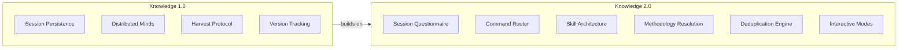
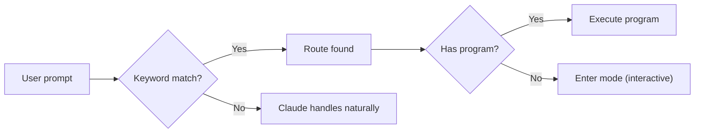
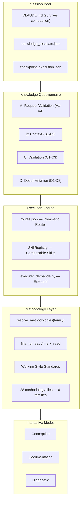

# Knowledge 2.0 — Interactive Intelligence Framework
{: #pub-title}

**Contents**

- [Authors](#authors)
- [Abstract](#abstract)
- [What's New in 2.0](#whats-new-in-20-)
- [The Evolution: v1 → v2](#the-evolution-v1--v2)
- [1. The Session Questionnaire](#1-the-session-questionnaire)
- [2. The Command Router](#2-the-command-router)
- [3. The Skill Architecture](#3-the-skill-architecture)
- [4. Methodology Resolution](#4-methodology-resolution)
- [5. The Deduplication Engine](#5-the-deduplication-engine)
- [6. Interactive Modes](#6-interactive-modes)
- [7. Complete Architecture](#7-complete-architecture)
- [Legacy References — Knowledge 1.0](#legacy-references--knowledge-10-)

## Authors

**Martin Paquet** — Network security analyst programmer, network and system security administrator, and embedded software designer. Architect of Knowledge. Designed the persistence methodology, the distributed intelligence network, and the self-healing version-aware architecture. The insight behind Knowledge 2.0: session initialization is as critical as session persistence — a structured onboarding protocol replaces unstructured prompting.

**Claude** (Anthropic, Opus 4.6) — AI development partner. Co-architect of the Interactive Intelligence Framework. Implemented the session questionnaire, command router, skill registry, methodology resolution, and deduplication engine. This publication documents a system built collaboratively across 100+ sessions.

---

### Live Knowledge Graph

<div id="live-mindmap-embed" style="width:100%;min-height:40vh;overflow:auto;border:1px solid var(--border);border-radius:8px;padding:1rem;margin:0.5rem 0 1rem;">
<div class="loading">Loading live mindmap...</div>
</div>

<script>
(function() {
  var base = window.location.pathname.replace(/\/publications\/.*/, '/');
  var mindPath = base + 'Knowledge/K_MIND/mind/mind_memory.md';
  var container = document.getElementById('live-mindmap-embed');
  if (!container) return;

  fetch(mindPath)
    .then(function(r) {
      if (!r.ok) throw new Error('HTTP ' + r.status);
      return r.text();
    })
    .then(function(text) {
      var match = text.match(/```mermaid\s*\n([\s\S]*?)```/);
      if (!match) throw new Error('No mermaid block found');
      container.innerHTML = '<div class="mermaid">' + match[1].trim() + '</div>';
      if (window.mermaid) {
        mermaid.run({ nodes: container.querySelectorAll('.mermaid') });
      }
    })
    .catch(function(err) {
      container.innerHTML = '<p style="color:var(--muted);text-align:center;padding:2rem;">Mindmap unavailable: ' + err.message + '</p>';
    });
})();
</script>

<p style="font-size:0.8rem;color:var(--muted);text-align:right;margin-top:-0.5rem;"><a href="{{ site.baseurl }}/interfaces/live-mindmap/">Full-screen view &#x2197;</a></p>

---

## Abstract

Knowledge 1.0 solved **statelessness** — AI sessions that forget everything between conversations.

**Knowledge 2.0** solves the next problem: **session initialization chaos**. Even with persistent memory, every session starts with an unstructured prompt. Knowledge 2.0 introduces a structured questionnaire, deterministic command routing, composable skills, and methodology deduplication — so the session *understands what it's about to do* before doing it.

| Feature | Description |
|---------|-------------|
| **Session questionnaire** | Structured onboarding grid (A1–E3) validates context, extracts intent, confirms project scope. State persists on disk |
| **Command router** | `routes.json` maps user intent to programs deterministically — no AI interpretation |
| **Skill architecture** | `SkillRegistry` with composable units — self-contained and testable |
| **Methodology resolution** | Family-based loading — commands declare a family, get all matching files automatically |
| **Deduplication engine** | Session-level tracking — 66% reduction in methodology loading for multi-command sessions |
| **Interactive modes** | Three specialized sessions: Conception, Documentation, Diagnostic |
| **Checkpoint persistence** | Survives context compaction and crashes — automatic state recovery |
| **Work validation** | 5-block validation: Request (A), Quality (B), Integrity (C), Documentation (D), Approval (E) |

---

## What's New in 2.0 <span class="badge badge-new">NEW</span>

<div class="feature-grid">
<div class="feature-card">
<h4>Session Questionnaire</h4>
<p>Structured onboarding grid (A1–E3) validates context, extracts intent, and confirms project scope before work begins. State persists on disk.</p>
</div>
<div class="feature-card">
<h4>Command Router</h4>
<p><code>routes.json</code> maps user intent to programs deterministically. No AI interpretation — keywords trigger exact programs.</p>
</div>
<div class="feature-card">
<h4>Skill Architecture</h4>
<p><code>SkillRegistry</code> with composable units: <code>LireChoixSkill</code>, <code>FonctionSkill</code>, <code>ProgrammeSkill</code>. Self-contained and testable.</p>
</div>
<div class="feature-card">
<h4>Methodology Resolution</h4>
<p><code>resolve_methodologies(family)</code> scans by prefix. Commands declare a family, get all matching files. 6 families, 30 files.</p>
</div>
<div class="feature-card">
<h4>Deduplication Engine</h4>
<p>Session-level tracking: 2nd command in same family reads <strong>0 files</strong> instead of 9. 66% reduction in multi-command sessions.</p>
</div>
<div class="feature-card">
<h4>Interactive Modes</h4>
<p>Three specialized sessions: <strong>Conception</strong> (design), <strong>Documentation</strong> (content), <strong>Diagnostic</strong> (debugging). Each with its own phase pattern.</p>
</div>
</div>

## The Evolution: v1 → v2



<table class="comparison-table">
<thead>
<tr><th>Dimension</th><th>v1 <span class="badge badge-v1">1.0</span></th><th>v2 <span class="badge badge-new">2.0</span></th></tr>
</thead>
<tbody>
<tr><td><strong>Session start</strong></td><td class="v1">Unstructured prompt — AI guesses intent</td><td class="v2">Questionnaire validates context → routes to correct mode</td></tr>
<tr><td><strong>Command execution</strong></td><td class="v1">AI interprets natural language</td><td class="v2"><code>routes.json</code> maps to programs — deterministic</td></tr>
<tr><td><strong>Methodology loading</strong></td><td class="v1">Read everything on wakeup</td><td class="v2">Family-based resolution — load only what's needed</td></tr>
<tr><td><strong>Repeated commands</strong></td><td class="v1">Re-read all methodology files</td><td class="v2">Deduplication — 0 files on 2nd invocation</td></tr>
<tr><td><strong>Working modes</strong></td><td class="v1">One mode (work)</td><td class="v2">Three interactive modes + command mode</td></tr>
<tr><td><strong>Validation</strong></td><td class="v1">Manual</td><td class="v2">Knowledge grid (A1-D3)</td></tr>
<tr><td><strong>Crash recovery</strong></td><td class="v1">Notes + git history</td><td class="v2">Checkpoint files + status queries</td></tr>
</tbody>
</table>

## 1. The Session Questionnaire

Every session begins with a structured validation grid — replacing unstructured guessing with a deterministic protocol.

| Knowledge | ID | Question | Action Type |
|-----------|----|----------|-------------|
| **A — Request Validation** | A1 | Confirm the title | function |
| | A2 | Confirm the description | program |
| | A3 | Confirm the project | function |
| | A4 | Execute request | executer_demande |
| **B — Work Quality** | B1 | Tests and build | program |
| | B2 | Code review | function |
| | B3 | Metrics | program |
| | B4 | All | all |
| **C — Session Integrity** | C1 | Progressive commits | function |
| | C2 | Cache up to date | program |
| | C3 | Issue commented | function |
| | C4 | All | all |
| **D — Documentation** | D1 | System documentation | function |
| | D2 | User documentation | function |
| | D3 | All | all |
| **E — Approval** | E1 | Pre-save summary | function |
| | E2 | Final save | program |
| | E3 | All | all |

> **Persistence**: State saved in `.claude/knowledge_resultats.json`. Survives compaction and crashes. After recovery: `en_cours: true` → resume, `demande_executee: true` → skip re-execution.

## 2. The Command Router

Commands are **routed**, not interpreted. `routes.json` maps keywords to programs.



| Route | Syntax | Program | Type |
|-------|--------|---------|------|
| `project-create` | `project create [title]` | `scripts/project_create.py` | Command |
| `interactive` | `interactif` | — | Mode switch |

## 3. The Skill Architecture

Knowledge is decomposed into composable **skills** — each a self-contained unit registered in `SkillRegistry`.

| Skill | Role | Used By |
|-------|------|---------|
| `LireChoixSkill` | Read user choice (1-N) | Questionnaire navigation |
| `FonctionSkill` | Execute internal function | A1, A3, B2, C1, C3 |
| `ProgrammeSkill` | Execute external program | A2, B1, B3, C2 |

```
KnowledgeSkill → registre.executer("lire_choix") → LireChoixSkill
               → registre.executer("fonction")   → FonctionSkill
               → registre.executer("programme")  → ProgrammeSkill
```

## 4. Methodology Resolution

Commands declare a **family**, the system resolves all matching methodology files automatically.

| Family Prefix | Files | Used By |
|---------------|-------|---------|
| `documentation` | 6 files | pub new, pub check, docs check |
| `interactive` | 4 files | interactif, live, normalize |
| `system` | 5 files | Infrastructure commands |
| `satellite` | 2 files | bootstrap, satellite commands |
| `project` | 2 files | project create, project manage |
| `compilation` | 2 files | Metrics and time tracking |

## 5. The Deduplication Engine


| Scenario | Without Dedup | With Dedup |
|----------|--------------|------------|
| 1st interactive command | 7 files read | 7 files read |
| 2nd interactive command | 7 files read | **0 files read** |
| 3rd interactive command | 7 files read | **0 files read** |
| **Total for 3 commands** | **21 file reads** | **7 file reads** |

> **66% reduction** in methodology loading for multi-command sessions.

## 6. Interactive Modes

<div class="feature-grid">
<div class="feature-card">
<h4>Conception</h4>
<p>Design new capabilities, explore architectures, prototype features. Phase: Anchor → Ideate → Explore → Propose → Prototype → Validate → Iterate → Formalize → Deliver.</p>
</div>
<div class="feature-card">
<h4>Documentation</h4>
<p>Create publications, methodologies, system docs. Phase: Assess → Structure → Draft → Review → Finalize.</p>
</div>
<div class="feature-card">
<h4>Diagnostic</h4>
<p>Live debugging, real-time analysis, forensic investigation. Phase: Observe → Hypothesize → Test → Fix → Verify.</p>
</div>
</div>

## 7. Complete Architecture



---

<div class="annex-section" markdown="1">

## Legacy References — Knowledge 1.0 <span class="badge badge-legacy">v1</span>

> **[Knowledge v1 — Self-Evolving AI Engineering Intelligence](https://github.com/packetqc/knowledge/tree/main/knowledge/data/publications/knowledge-system/v1)** — The 825-line master publication. Session persistence, distributed minds, core qualities, memory architecture, satellite network, and 26 versions of evolution in 5 days.

### Child Publications

| # | Publication | Links |
|---|-------------|-------|
| 0 | Knowledge System (Master) | [Source](https://github.com/packetqc/knowledge/tree/main/knowledge/data/publications/knowledge-system/v1) · [Web]({{ site.baseurl }}/publications/knowledge-system/) |
| 1 | MPLIB Storage Pipeline | [Source](https://github.com/packetqc/knowledge/tree/main/knowledge/data/publications/mplib-storage-pipeline/v1) · [Web]({{ site.baseurl }}/publications/mplib-storage-pipeline/) |
| 2 | Live Session Analysis | [Source](https://github.com/packetqc/knowledge/tree/main/knowledge/data/publications/live-session-analysis/v1) · [Web]({{ site.baseurl }}/publications/live-session-analysis/) |
| 3 | AI Session Persistence | [Source](https://github.com/packetqc/knowledge/tree/main/knowledge/data/publications/ai-session-persistence/v1) · [Web]({{ site.baseurl }}/publications/ai-session-persistence/) |
| 4 | Distributed Minds | [Source](https://github.com/packetqc/knowledge/tree/main/knowledge/data/publications/distributed-minds/v1) · [Web]({{ site.baseurl }}/publications/distributed-minds/) |
| 4a | Knowledge Dashboard | [Source](https://github.com/packetqc/knowledge/tree/main/knowledge/data/publications/distributed-knowledge-dashboard/v1) · [Web]({{ site.baseurl }}/publications/distributed-knowledge-dashboard/) |
| 5 | Webcards & Social Sharing | [Source](https://github.com/packetqc/knowledge/tree/main/knowledge/data/publications/webcards-social-sharing/v1) · [Web]({{ site.baseurl }}/publications/webcards-social-sharing/) |
| 6 | Normalize | [Source](https://github.com/packetqc/knowledge/tree/main/knowledge/data/publications/normalize-structure-concordance/v1) · [Web]({{ site.baseurl }}/publications/normalize-structure-concordance/) |
| 7 | Harvest Protocol | [Source](https://github.com/packetqc/knowledge/tree/main/knowledge/data/publications/harvest-protocol/v1) · [Web]({{ site.baseurl }}/publications/harvest-protocol/) |
| 8 | Session Management | [Source](https://github.com/packetqc/knowledge/tree/main/knowledge/data/publications/session-management/v1) · [Web]({{ site.baseurl }}/publications/session-management/) |
| 9 | Security by Design | [Source](https://github.com/packetqc/knowledge/tree/main/knowledge/data/publications/security-by-design/v1) · [Web]({{ site.baseurl }}/publications/security-by-design/) |
| 10 | Live Knowledge Network | [Source](https://github.com/packetqc/knowledge/tree/main/knowledge/data/publications/live-knowledge-network/v1) · [Web]({{ site.baseurl }}/publications/live-knowledge-network/) |

### Key v1 Sections

| Topic | What it covers |
|-------|---------------|
| [Core Qualities](https://github.com/packetqc/knowledge/tree/main/knowledge/data/publications/knowledge-system/v1#core-qualities) | 11 principles — self-sufficient, autonomous, concordant, concise, interactive, evolutionary, distributed, persistent, recursive, secure, resilient |
| [Knowledge Evolution](https://github.com/packetqc/knowledge/tree/main/knowledge/data/publications/knowledge-system/v1#knowledge-evolution) | v1→v26 timeline — 26 versions in 5 days |
| [Memory Architecture](https://github.com/packetqc/knowledge/tree/main/knowledge/data/publications/knowledge-system/v1#memory-architecture) | Auto-memory vs Knowledge, compaction survival, context window mechanics |
| [Satellite Network](https://github.com/packetqc/knowledge/tree/main/knowledge/data/publications/knowledge-system/v1#satellite-harvest--what-the-network-produced) | 6 satellites, harvest results, 12 promotion candidates |

> **Note**: All publications are now unified in `packetqc/knowledge`. Knowledge 2.0 served as the integration test for this migration.

</div>
