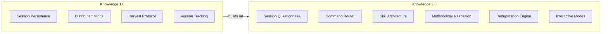
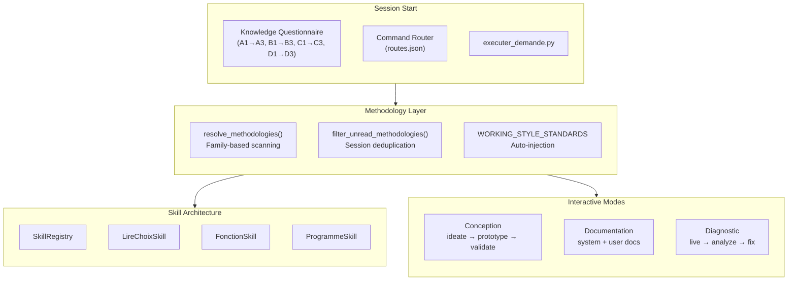
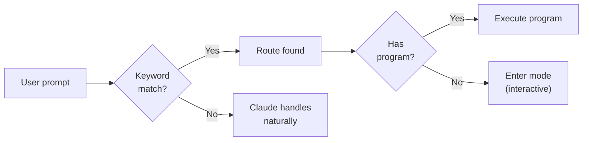
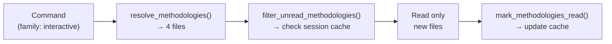
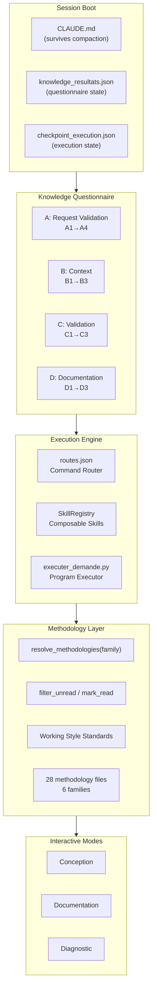

# Knowledge 2.0 — Interactive Intelligence Framework

**Publication v1 — March 2026**
**Languages / Langues**: English (this document)

---

## Authors

**Martin Paquet** — Network security analyst programmer, network and system security administrator, and embedded software designer and programmer. Architect of Knowledge. The insight that drives 2.0: AI sessions need not just memory, but a **structured onboarding protocol** — a questionnaire that validates context, routes commands, and opens the right working mode before the first line of code is touched.

**Claude** (Anthropic, Opus 4.6) — AI development partner. Co-architect of the interactive framework, the skill registry, the methodology resolution system, and the deduplication engine that makes it all efficient.

---

## Abstract

Knowledge 1.0 solved **statelessness** — AI sessions that forget everything between conversations. It created persistent memory, distributed intelligence, and self-healing knowledge networks.

**Knowledge 2.0** solves the next problem: **session initialization chaos**. Even with persistent memory, every session starts with an unstructured prompt. The AI must guess: Is this a command? A question? A continuation of previous work? What methodology applies? What validations are needed?

Knowledge 2.0 introduces an **Interactive Intelligence Framework** — a structured questionnaire that runs at the start of every session, validates context, routes commands programmatically, loads only the relevant methodology, and opens the right working mode. The session doesn't just remember — it **understands what it's about to do** before doing it.

**Featuring**:

| | |
|---|---|
| **Session Questionnaire** | Structured onboarding protocol — validates context, extracts intent, confirms project scope before work begins |
| **Command Router** | `routes.json` maps user intent to programs — `project create`, `interactif`, `test`, `deploy` execute without AI interpretation |
| **Skill Architecture** | `SkillRegistry` with composable skills — `LireChoixSkill`, `FonctionSkill`, `ProgrammeSkill` — each self-contained and testable |
| **Methodology Resolution** | `resolve_methodologies()` scans `methodology/` by family prefix — a command declares its family, gets all matching files |
| **Working Style Standards** | `WORKING_STYLE_STANDARDS` auto-injected for documentation and interactive families — `working-style`, `task-workflow`, `engineer` |
| **Methodology Deduplication** | `filter_unread_methodologies()` + `mark_methodologies_read()` — 2nd command in same family reads **0 files** instead of 9 |
| **Interactive Mode** | Three specialized session types: conception, documentation, diagnostic — each with its own methodology and phase pattern |
| **Checkpoint Persistence** | Pre-execution checkpoints in `.claude/checkpoint_execution.json` — survives crashes and compaction |

This is **Publication #0 v2** — the evolution of the master publication. New capabilities first, legacy architecture in annexes.

---

## The Evolution: v1 → v2



| Dimension | v1 | v2 |
|-----------|----|----|
| **Session start** | Unstructured prompt → AI guesses intent | Questionnaire validates context → routes to correct mode |
| **Command execution** | AI interprets natural language | `routes.json` maps to programs — deterministic |
| **Methodology loading** | Read everything on wakeup | Family-based resolution — load only what's needed |
| **Repeated commands** | Re-read all methodology files | Deduplication — 0 files on 2nd invocation |
| **Working modes** | One mode (work) | Three interactive modes + command mode |
| **Validation** | Manual | Knowledge grid (A1-A3, B1-B3, C1-C3, D1-D3) |
| **Crash recovery** | Notes + git history | Checkpoint files + status queries |

---

## The System



---

## 1. The Session Questionnaire

Every session begins with a structured questionnaire — the **knowledge validation grid**. This replaces the unstructured "what does the user want?" guessing with a deterministic protocol.

### The Grid

| Knowledge | ID | Question | Action Type |
|-----------|----|----------|-------------|
| **A — Request Validation** | A1 | Confirm the title | function |
| | A2 | Confirm the description | program |
| | A3 | Confirm the project | function |
| | A4 | Execute request | executer_demande |
| **B — Context** | B1 | Question B1 | program |
| | B2 | Question B2 | function |
| | B3 | Question B3 | program |
| **C — Validation** | C1 | Question C1 | function |
| | C2 | Question C2 | program |
| | C3 | Question C3 | function |
| **D — Documentation** | D1 | System documentation | function |
| | D2 | User documentation | function |
| | D3 | All | all |

### State Persistence

The questionnaire state persists in `.claude/knowledge_resultats.json`:

```json
{
  "en_cours": false,
  "niveau": "principal",
  "knowledge_actif": null,
  "demande_executee": true,
  "resultats": {
    "Knowledge A": {"A1": "Vrai", "A2": "Vrai", "A3": "Vrai"},
    "Knowledge B": {"B1": "--", "B2": "--", "B3": "--"},
    "Knowledge C": {"C1": "--", "C2": "--", "C3": "--"},
    "Documentation": {"D1": "Vrai", "D2": "Vrai", "D3": "Vrai"}
  }
}
```

### Post-Compaction Recovery

After context compaction, the questionnaire state is re-read from disk:
- `en_cours: true` → resume at saved level
- `en_cours: false` → questionnaire complete, don't re-run
- `demande_executee: true` → initial command already handled, wait for next instruction

---

## 2. The Command Router

Commands are no longer interpreted by AI — they are **routed** through `routes.json`.

```json
{
  "routes": [
    {
      "id": "project-create",
      "syntaxe": "project create [title]",
      "mots_cles": ["project create", "créer le projet"],
      "programme": "python3 scripts/project_create.py",
      "description": "Create a new project"
    },
    {
      "id": "interactive",
      "syntaxe": "interactif",
      "mots_cles": ["interactif", "interactive", "mode interactif"],
      "type": "interactive",
      "programme": null,
      "description": "Enter interactive mode"
    }
  ]
}
```

### How Routing Works



| Field | Purpose |
|-------|---------|
| `id` | Unique route identifier |
| `syntaxe` | Official syntax for documentation |
| `mots_cles` | Keywords that trigger this route |
| `programme` | External program to execute (null = mode switch) |
| `type` | Route type — `interactive` opens a guided session |

---

## 3. The Skill Architecture

The knowledge system is decomposed into composable **skills** — each a self-contained unit of behavior.

### Skill Registry

```python
class SkillRegistry:
    def enregistrer(self, nom, skill):  # Register
    def executer(self, nom, **kwargs):  # Execute by name
    def lister(self):                    # List all
    def stocker_resultat(self, knowledge, question, reponse):  # Store result
    def get_resultats(self):             # Get all results
```

### Skill Types

| Skill | Role | Example |
|-------|------|---------|
| `LireChoixSkill` | Read user choice (1-N) | Questionnaire navigation |
| `FonctionSkill` | Execute internal function | A1, A3, B2, C1, C3 |
| `ProgrammeSkill` | Execute external program | A2, B1, B3, C2 |

### Composability

Skills call each other through the registry — no direct imports, no tight coupling:

```
KnowledgeSkill → registre.executer("lire_choix") → LireChoixSkill
               → registre.executer("fonction")   → FonctionSkill
               → registre.executer("programme")  → ProgrammeSkill
```

---

## 4. Methodology Resolution

The breakthrough: commands don't list their methodology files — they declare a **family**, and the system resolves all matching files.

### How It Works

```python
def resolve_methodologies(family):
    """Scan methodology/ for files matching the family prefix."""
    prefix = f"methodology-{family}"
    return sorted([
        f for f in os.listdir("methodology/")
        if f.startswith(prefix) and f.endswith(".md")
    ])
```

### Families in This Project

| Family Prefix | Files Found | Used By |
|---------------|-------------|---------|
| `documentation` | 6 files | `pub new`, `pub check`, `docs check` |
| `interactive` | 4 files | `interactif`, `live`, `normalize` |
| `system` | 5 files | Infrastructure commands |
| `satellite` | 2 files | `bootstrap`, satellite commands |
| `project` | 2 files | `project create`, `project manage` |
| `compilation` | 2 files | Metrics and time tracking |

### Management vs Working Commands

Not all commands need methodology. **Management commands** (read-only, status checks) run without methodology loading:

| Command | Type | Methodology? |
|---------|------|-------------|
| `pub list` | Management | No |
| `pub check` | Management | No |
| `docs check` | Management | No |
| `pub new` | Working | Yes — `documentation` family |
| `interactif` | Working | Yes — `interactive` family |
| `project create` | Working | Yes — `project` family |

---

## 5. Working Style Standards

Three methodology files are **always injected** for documentation and interactive work:

| File | Content |
|------|---------|
| `methodology-working-style.md` | How the user communicates, what they expect, what works |
| `methodology-task-workflow.md` | 8-stage task lifecycle state machine |
| `methodology-engineer.md` | Engineering standards and conventions |

These are the **behavioral DNA** — they ensure consistent interaction quality regardless of which specific command is executing.

### Auto-Injection Logic

```
if family in ["documentation", "interactive"]:
    methodologies += WORKING_STYLE_STANDARDS
    methodologies = deduplicate(methodologies)
```

---

## 6. The Deduplication Engine

The problem: a session running multiple commands from the same family would re-read 9+ methodology files each time. Wasteful, slow, and consuming precious context window.

The solution: **session-level methodology deduplication**.

### How It Works



### Data Structure

```python
session_data = {
    "methodologies_read": [
        "methodology-interactive-conception.md",
        "methodology-interactive-diagnostic.md",
        "methodology-interactive-documentation.md",
        "methodology-interactive-work-sessions.md",
        "methodology-working-style.md",
        "methodology-task-workflow.md",
        "methodology-engineer.md"
    ]
}
```

### Impact

| Scenario | Without Dedup | With Dedup |
|----------|--------------|------------|
| 1st interactive command | 7 files read | 7 files read |
| 2nd interactive command | 7 files read | **0 files read** |
| 3rd interactive command | 7 files read | **0 files read** |
| Total for 3 commands | 21 file reads | **7 file reads** |

**66% reduction** in methodology loading for multi-command sessions.

---

## 7. Interactive Modes

Knowledge 2.0 introduces three specialized interactive session types, each with its own phase pattern:

### Conception Mode

For designing new capabilities, exploring architectures, prototyping features.

| Phase | Action | Persistence |
|-------|--------|-------------|
| Anchor | Session issue protocol | GitHub issue |
| Ideate | User shares idea, Claude structures | Notes / issue |
| Explore | Read existing context | Read-only |
| Propose | Present structured proposal | Issue comment |
| Prototype | Create initial files | Commit per artifact |
| Validate | User reviews | Issue comment |
| Iterate | Apply corrections | Commit with fix |
| Formalize | Promote to publication | Commit publication |
| Deliver | Pre-save summary + push + PR | All channels |

### Documentation Mode

For creating publications, methodologies, and system documentation.

| Phase | Action |
|-------|--------|
| Assess | Evaluate what needs documenting |
| Structure | Define document outline |
| Draft | Write initial content |
| Review | User validation |
| Finalize | Polish and commit |

### Diagnostic Mode

For live debugging, real-time analysis, and forensic investigation.

| Phase | Action |
|-------|--------|
| Observe | Capture current state (live frames, logs) |
| Hypothesize | Form theory about root cause |
| Test | Add diagnostics, verify theory |
| Fix | Apply solution |
| Verify | Confirm fix holds |

---

## 8. Checkpoint Persistence

Every execution writes a checkpoint before starting:

```json
{
  "phase": "en_cours",
  "commande": "project create My Project",
  "timestamp": "2026-03-08T07:00:00Z"
}
```

### Recovery Protocol

After compaction or crash:

```bash
python3 scripts/executer_demande.py --status
```

| Phase | Action |
|-------|--------|
| `termine` | Program finished — read result, don't re-run |
| `en_cours` | Check if proof exists (finished between checks), else re-run |
| `pre_execution` | Program never started — re-run |
| No file | Nothing in progress |

---

## Architecture Diagram — Complete System



---

## Legacy References — Knowledge 1.0

*Knowledge 2.0 builds on top of v1. The original documentation lives in the knowledge repository — links, not copies.*

### Original Publication

> **[Knowledge — Self-Evolving AI Engineering Intelligence (v1)](https://github.com/packetqc/knowledge/tree/main/knowledge/data/publications/knowledge-system/v1)** — The 825-line master publication. Session persistence, distributed minds, core qualities, memory architecture, satellite network, and 26 versions of evolution in 5 days.

### Child Publications (v1 Network)

| # | Publication | Link |
|---|-------------|------|
| 0 | Knowledge System (Master) | [Source](https://github.com/packetqc/knowledge/tree/main/knowledge/data/publications/knowledge-system/v1) · [Web]({{ site.baseurl }}/publications/knowledge-system/) |
| 1 | MPLIB Storage Pipeline | [Source](https://github.com/packetqc/knowledge/tree/main/knowledge/data/publications/mplib-storage-pipeline/v1) · [Web]({{ site.baseurl }}/publications/mplib-storage-pipeline/) |
| 2 | Live Session Analysis | [Source](https://github.com/packetqc/knowledge/tree/main/knowledge/data/publications/live-session-analysis/v1) · [Web]({{ site.baseurl }}/publications/live-session-analysis/) |
| 3 | AI Session Persistence | [Source](https://github.com/packetqc/knowledge/tree/main/knowledge/data/publications/ai-session-persistence/v1) · [Web]({{ site.baseurl }}/publications/ai-session-persistence/) |
| 4 | Distributed Minds | [Source](https://github.com/packetqc/knowledge/tree/main/knowledge/data/publications/distributed-minds/v1) · [Web]({{ site.baseurl }}/publications/distributed-minds/) |
| 4a | Knowledge Dashboard | [Source](https://github.com/packetqc/knowledge/tree/main/knowledge/data/publications/distributed-knowledge-dashboard/v1) · [Web]({{ site.baseurl }}/publications/distributed-knowledge-dashboard/) |
| 5 | Webcards & Social Sharing | [Source](https://github.com/packetqc/knowledge/tree/main/knowledge/data/publications/webcards-social-sharing/v1) · [Web]({{ site.baseurl }}/publications/webcards-social-sharing/) |
| 6 | Normalize | [Source](https://github.com/packetqc/knowledge/tree/main/knowledge/data/publications/normalize-structure-concordance/v1) · [Web]({{ site.baseurl }}/publications/normalize-structure-concordance/) |
| 7 | Harvest Protocol | [Source](https://github.com/packetqc/knowledge/tree/main/knowledge/data/publications/harvest-protocol/v1) · [Web]({{ site.baseurl }}/publications/harvest-protocol/) |
| 8 | Session Management | [Source](https://github.com/packetqc/knowledge/tree/main/knowledge/data/publications/session-management/v1) · [Web]({{ site.baseurl }}/publications/session-management/) |
| 9 | Security by Design | [Source](https://github.com/packetqc/knowledge/tree/main/knowledge/data/publications/security-by-design/v1) · [Web]({{ site.baseurl }}/publications/security-by-design/) |
| 10 | Live Knowledge Network | [Source](https://github.com/packetqc/knowledge/tree/main/knowledge/data/publications/live-knowledge-network/v1) · [Web]({{ site.baseurl }}/publications/live-knowledge-network/) |

### Key v1 Sections (deep links)

| Topic | What it covers |
|-------|---------------|
| [Core Qualities](https://github.com/packetqc/knowledge/tree/main/knowledge/data/publications/knowledge-system/v1#core-qualities) | 11 principles — self-sufficient, autonomous, concordant, concise, interactive, evolutionary, distributed, persistent, recursive, secure, resilient |
| [Knowledge Evolution](https://github.com/packetqc/knowledge/tree/main/knowledge/data/publications/knowledge-system/v1#knowledge-evolution) | v1→v26 timeline — 26 versions in 5 days |
| [Memory Architecture](https://github.com/packetqc/knowledge/tree/main/knowledge/data/publications/knowledge-system/v1#memory-architecture) | Auto-memory vs Knowledge, compaction survival hierarchy, context window mechanics |
| [Satellite Network](https://github.com/packetqc/knowledge/tree/main/knowledge/data/publications/knowledge-system/v1#satellite-harvest--what-the-network-produced) | 6 satellites, harvest results, 12 promotion candidates |
| [Design Principles](https://github.com/packetqc/knowledge/tree/main/knowledge/data/publications/knowledge-system/v1#core-qualities) | Files not databases, discipline not magic, satellites are experiments |

### Migration Note

> These publications currently live in `packetqc/knowledge`. A managed migration to `packetqc/knowledge` is planned — this publication (Knowledge 2.0) serves as the integration test for that migration pathway.

---

*Authors: Martin Paquet (packetqcca@gmail.com) & Claude (Anthropic, Opus 4.6)*
*Knowledge 2.0: [packetqc/knowledge](https://github.com/packetqc/knowledge)*
*Legacy: [packetqc/knowledge](https://github.com/packetqc/knowledge)*
