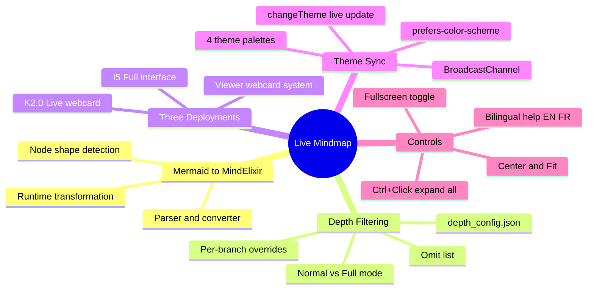

# Live Mindmap — Interactive Knowledge Graph
{: #pub-title}

> **Parent**: [Publication #24 — Summary]({{ '/publications/live-mindmap/' | relative_url }})

---

## Abstract

The K_MIND memory system stores its knowledge graph as a mermaid mindmap in `mind_memory.md`. Mermaid renders this as a static SVG — no expand/collapse, no zoom, no depth control. The Live Mindmap transforms this into an interactive MindElixir knowledge graph at runtime.

A JavaScript converter parses mermaid syntax and builds a MindElixir-compatible tree. The depth filtering system — a port of `mindmap_filter.py` — applies `depth_config.json` rules in the browser, ensuring consistency between CLI and web views. Three deployment points serve different contexts: I5 full-screen interface with toolbar, K2.0 live webcard, and viewer webcard for any page with `live_webcard: mindmap`.

Theme synchronization maps the viewer's four CSS themes to MindElixir palettes — updates propagate instantly via `changeTheme()`, no re-initialization needed. The system fetches directly from GitHub's raw API, always reflecting the latest committed state.



---

<div class="story-section">

## 1. Problem

The K_MIND knowledge graph lives in `mind_memory.md` as a mermaid mindmap. Mermaid renders this as a static SVG — useful for documentation, but limited:

| Limitation | Impact |
|---|---|
| No expand/collapse | All visible nodes render at once — visual overload for deep trees |
| No zoom/pan | Diagram scales with page, no independent navigation |
| No depth control | All nodes render or none — no filtering |
| No theme reactivity | Mermaid themes disconnected from viewer's 4-theme CSS |
| No drag interaction | Nodes fixed in mermaid's radial auto-layout |

The depth filtering script (`mindmap_filter.py`) controls CLI output, but had no browser equivalent.

## 2. Mermaid-to-MindElixir Converter

The `mermaidToMindElixir()` function parses mermaid mindmap syntax at runtime:

```
Input:  mindmap\n  root((knowledge))\n    session\n      near memory
Output: { nodeData: { topic: 'knowledge', id: 'root', children: [...] }, direction: 2 }
```

**Parser steps:**
1. Strip header lines (`%%{init}`, `mindmap`, `root((...))`)
2. Calculate indent level (2 spaces per level)
3. Strip mermaid node decorators (`((...))`, `(...)`, `[...]`, `{...}`)
4. Build recursive tree with `topic`, `id`, and `children` fields

## 3. Depth Filtering

JavaScript port of `mindmap_filter.py` applying `depth_config.json`:

| Config field | Purpose | Default |
|---|---|---|
| `default_depth` | Maximum depth for all branches | 3 |
| `omit` | Branches hidden in Normal mode | architecture, constraints |
| `overrides` | Per-branch depth overrides | session/near memory: 4 |

**Longest-match rule**: `session/near memory` at depth 4 takes precedence over `session` at depth 3.

**Normal mode**: Applies depth config — omits architecture/constraints, limits depth per branch.

**Full mode**: Shows all nodes at max depth, no omissions.

After filtering, `collapseDeep()` sets `node.expanded = false` beyond the default depth — tree starts collapsed but can be expanded interactively.

## 4. Three Deployment Points

### I5 — Full-Screen Interface

| Control | Function |
|---|---|
| Normal/Full toggle | Switch between filtered and complete views |
| Theme selector | Cayman, Midnight, Daltonism Light/Dark, Auto |
| Reload | Re-fetch from GitHub raw API |
| Center | Center map without scaling |
| Fit | Scale map to fit viewport |
| Fullscreen | Toggle browser fullscreen |
| `Ctrl+Click` on `+` | Expand all descendants at once |

- Bilingual help panel with keyboard shortcuts (EN/FR)
- FR version hardcodes `LANG='fr'` (srcdoc iframe has `about:srcdoc` as pathname)
- Fetches from `https://raw.githubusercontent.com/packetqc/K_DOCS/main/Knowledge/K_MIND/`

### K2.0 Live Webcard

- Replaces static OG image GIF at page top
- Compact 300px height, `scaleFit()` on load
- Same depth filtering and theme sync
- `live_webcard: mindmap` in front matter triggers rendering
- Instance stored as `window._webcardMind` for live theme updates

### Viewer Webcard System

- Any page with `live_webcard: mindmap` gets a live mindmap header
- `buildLiveMindmapWebcard()` creates a self-contained MindElixir instance
- Falls back to static `og_image` GIF if MindElixir fails to load

## 5. Theme Synchronization

Four MindElixir palettes map to viewer CSS themes:

| Viewer Theme | Background | Root Node | Palette |
|---|---|---|---|
| Daltonism Light | `#faf6f1` | `#0055b3` | Warm, accessible |
| Daltonism Dark | `#1a1a2e` | `#2a4a7a` | Warm dark |
| Cayman | `#eff6ff` | `#1d4ed8` | Cool blue |
| Midnight | `#0f172a` | `#1e40af` | Cool dark |

**Propagation paths:**
1. Same document → direct `changeTheme()` on MindElixir instance
2. Same-origin iframes → `BroadcastChannel('kdocs-theme-sync')`
3. srcdoc iframes → recursive `data-theme` attribute propagation

## 6. The Numbers

| Metric | Value |
|---|---|
| MindElixir version | 5.9.3 |
| Deployment points | 3 (I5, K2.0 webcard, viewer webcard) |
| Theme palettes | 4 |
| Depth config fields | 3 (default_depth, omit, overrides) |
| Build step | None — runtime conversion |
| Data source | GitHub raw API (always latest commit) |
| Languages | 2 (EN, FR) |

</div>

---

*Martin Paquet & Claude (Opus 4.6) | [packetqc/K_DOCS](https://github.com/packetqc/K_DOCS)*
