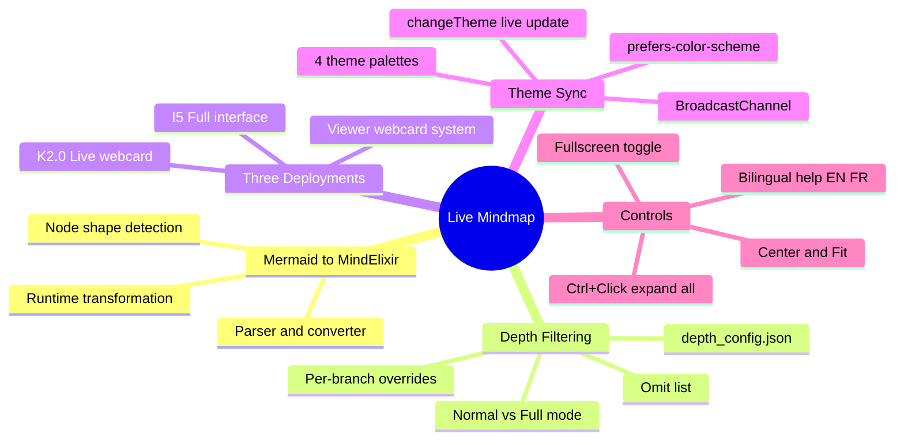

## Abstract

The K_MIND memory system stores its knowledge graph as a mermaid mindmap in `mind_memory.md`. Mermaid renders this as a static SVG — no expand/collapse, no zoom, no depth control. The Live Mindmap transforms this into an interactive MindElixir knowledge graph at runtime.

A JavaScript converter parses mermaid syntax and builds a MindElixir-compatible tree. The depth filtering system — a port of `mindmap_filter.py` — applies `depth_config.json` rules in the browser, ensuring consistency between CLI and web views. Three deployment points serve different contexts: I5 full-screen interface with toolbar, K2.0 live webcard, and viewer webcard for any page with `live_webcard: mindmap`.

Theme synchronization maps the viewer's four CSS themes to MindElixir palettes — updates propagate instantly via `changeTheme()`, no re-initialization needed. The system fetches directly from GitHub's raw API, always reflecting the latest committed state.

### Key Features

| Feature | Description |
|---------|-------------|
| **Mermaid converter** | Parses mermaid mindmap syntax → MindElixir tree at runtime |
| **Depth filtering** | JS port of `mindmap_filter.py` with `depth_config.json` |
| **3 deployment points** | I5 interface, K2.0 webcard, viewer webcard system |
| **4-theme sync** | Daltonism Light/Dark, Cayman, Midnight — instant `changeTheme()` |
| **Interactive controls** | Expand/collapse, zoom/pan, Ctrl+Click expand-all |
| **Bilingual** | EN/FR toolbar labels, help panel, status messages |

---

## Read More

- **[Complete documentation](full/)** — Full publication with converter details, depth filtering, and theme architecture
- **[Success Story #25]({{ '/publications/success-stories/story-25/' | relative_url }})** — The story behind building this

---

*Martin Paquet & Claude (Opus 4.6) | [packetqc/K_DOCS](https://github.com/packetqc/K_DOCS)*
