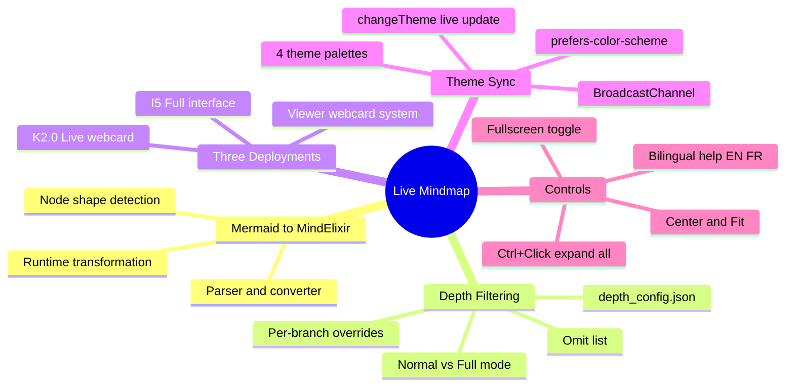

# Publication #24 — Live Mindmap: Interactive Knowledge Graph

**Publication #24 v1 | March 2026**

**Authors**: Martin Paquet (system architect) & Claude (Opus 4.6, Anthropic — implementation partner)

---

## Abstract

The K_MIND memory system stores its knowledge graph as a mermaid mindmap in a single markdown file (`mind_memory.md`). This representation is compact and version-controlled, but mermaid mindmaps are static — they render as SVG images with no interactivity beyond what the browser offers natively.

The Live Mindmap transforms this static representation into an interactive, draggable, expandable knowledge graph using MindElixir v5.9.3. A JavaScript converter (`mermaidToMindElixir()`) parses the mermaid mindmap syntax and builds a MindElixir-compatible data structure at runtime. The depth filtering system — a JavaScript port of `mindmap_filter.py` — applies the same `depth_config.json` rules that control the CLI display, ensuring visual consistency between the terminal and the browser.

Three deployment points serve different contexts: Interface I5 provides a full-screen dedicated view with toolbar controls (theme selector, Normal/Full mode toggle, Center/Fit/Fullscreen buttons, and bilingual help panel). The Knowledge 2.0 publication embeds a live webcard — a compact MindElixir instance that replaces the static OG image GIF at the top of the page. The viewer's webcard system renders the same compact view for any page with `live_webcard: mindmap` in its front matter.

Theme synchronization maps the viewer's four CSS themes to MindElixir palette objects. When the user changes themes, the mindmap updates instantly via `changeTheme()` — no re-initialization required. The system fetches `mind_memory.md` directly from GitHub's raw content API, so the mindmap always reflects the latest committed state of the knowledge graph.



---

## 1. Problem

The K_MIND knowledge graph lives in `mind_memory.md` as a mermaid mindmap. Mermaid renders this as a static SVG — useful for documentation, but limited:

- **No expand/collapse** — all visible nodes render at once, creating visual overload for deep trees
- **No zoom/pan** — the diagram scales with the page, no independent navigation
- **No depth control** — mermaid has no concept of depth filtering; all nodes render or none
- **No theme reactivity** — mermaid diagrams use their own theme system, disconnected from the viewer's 4-theme CSS variables
- **No drag interaction** — nodes are fixed in mermaid's radial auto-layout

The depth filtering script (`mindmap_filter.py`) controls what appears in the CLI output, but this filtering has no equivalent in the browser until now.

---

## 2. Solution

### 2.1 Mermaid-to-MindElixir Converter

The `mermaidToMindElixir()` function parses mermaid mindmap syntax:

```
Input:  mindmap\n  root((knowledge))\n    session\n      near memory\n        conversation
Output: { nodeData: { topic: 'knowledge', id: 'root', children: [...] }, direction: 2 }
```

The parser:
1. Strips header lines (`%%{init}`, `mindmap`, `root((...))`)
2. Calculates indent level (2 spaces per level)
3. Strips mermaid node decorators (`((...))`, `(...)`, `[...]`, `{...}`)
4. Builds a recursive tree structure with `topic`, `id`, and `children` fields

### 2.2 Depth Filtering (JavaScript Port)

The `filterMindmap()` function is a JavaScript port of `mindmap_filter.py`:

| Config field | Purpose |
|---|---|
| `default_depth` | Maximum depth for all branches (default: 3) |
| `omit` | Branches hidden in Normal mode (default: architecture, constraints) |
| `overrides` | Per-branch depth overrides (e.g., `session/near memory: 4`) |

The longest-match rule applies for overrides: `session/near memory` at depth 4 takes precedence over `session` at depth 3.

**Normal mode**: Applies depth config — omits architecture/constraints, limits depth per branch.
**Full mode**: Shows all nodes at max depth, no omissions.

After filtering, `collapseDeep()` sets `node.expanded = false` on nodes beyond the default depth, so the tree starts collapsed but can be expanded interactively.

### 2.3 Three Deployment Points

**Interface I5 — Full-Screen Dedicated View**

- Toolbar: Normal/Full toggle, theme selector, Reload, Center, Fit, Fullscreen
- `Ctrl+Click` on expand button → expand all descendants at once
- Bilingual help panel (EN/FR) with keyboard shortcuts
- FR version hardcodes `LANG='fr'` (srcdoc iframe workaround)
- Fetches from `https://raw.githubusercontent.com/packetqc/K_DOCS/main/Knowledge/K_MIND/`

**Knowledge 2.0 Live Webcard**

- Replaces static OG image GIF at page top
- Compact 300px height, scaleFit on load
- Same depth filtering and theme sync
- `live_webcard: mindmap` in front matter triggers it
- Instance stored as `window._webcardMind` for theme updates

**Viewer Webcard System**

- Any page with `live_webcard: mindmap` gets a live mindmap header
- `buildLiveMindmapWebcard()` creates a self-contained MindElixir instance
- Falls back to static `og_image` GIF if MindElixir fails to load

### 2.4 Theme Synchronization

Four MindElixir palettes map to the viewer's CSS themes:

| Viewer Theme | MindElixir Background | Root Node Color | Palette Type |
|---|---|---|---|
| Daltonism Light | `#faf6f1` | `#0055b3` | Warm, accessible |
| Daltonism Dark | `#1a1a2e` | `#2a4a7a` | Warm dark |
| Cayman | `#eff6ff` | `#1d4ed8` | Cool blue |
| Midnight | `#0f172a` | `#1e40af` | Cool dark |

Theme changes propagate via:
1. **Same document**: Direct `changeTheme()` call on the MindElixir instance
2. **Same-origin iframes**: `BroadcastChannel('kdocs-theme-sync')`
3. **srcdoc iframes**: Recursive `data-theme` attribute propagation (BroadcastChannel can't reach null-origin srcdoc)

---

## 3. Impact

### Before
- Knowledge graph visible only as static mermaid SVG or CLI text output
- No browser-based interactive exploration
- Theme changes required page reload for mermaid re-render
- Depth filtering only available via Python script

### After
- Live interactive graph in 3 contexts (full interface, webcard, publication header)
- Expand/collapse individual branches, zoom/pan freely
- Theme updates instantly without re-initialization
- Same depth config drives both CLI and browser views
- `Ctrl+Click` expand-all for deep exploration

### Design Principles

| Principle | Application |
|---|---|
| **Single source of truth** | `mind_memory.md` drives all views — CLI, mermaid, MindElixir |
| **Config-driven consistency** | `depth_config.json` controls both Python filter and JS filter |
| **Progressive disclosure** | Start collapsed, expand on demand |
| **Zero build step** | Fetches raw markdown from GitHub, converts at runtime |

---

## 4. Related

- [Publication #0 — Knowledge System](../knowledge-system/v1/README.md) — The system this mindmap visualizes
- [Publication #23 — Web Documentation Viewer](../web-documentation-viewer/v1/README.md) — The viewer that hosts the mindmap
- [Story #25 — Live Mindmap Memory](../../docs/publications/success-stories/story-25/) — The story behind building this

---

*Martin Paquet & Claude (Opus 4.6) | [packetqc/K_DOCS](https://github.com/packetqc/K_DOCS)*
