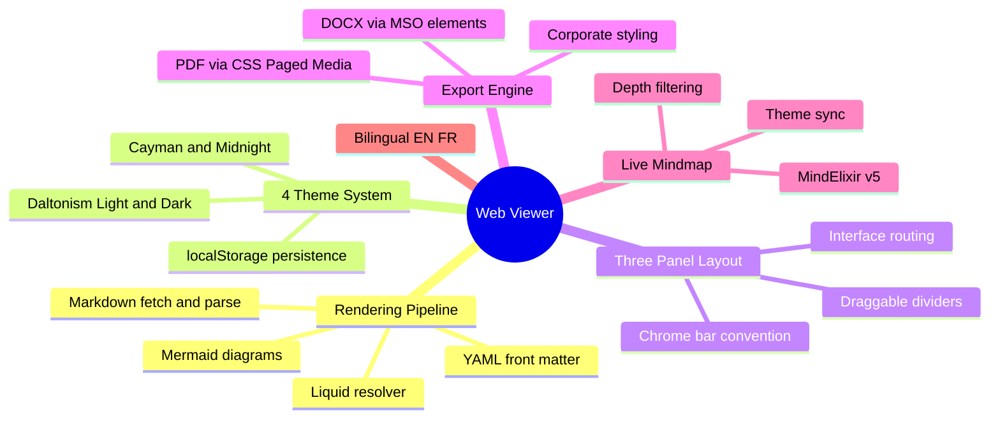

## Abstract

The K_DOCS Web Viewer solves a fundamental problem: how to serve rich, interactive documentation from a single static file with zero build step and zero server-side processing. The production Knowledge system (`packetqc/knowledge`) relies on Jekyll + GitHub Pages with two massive HTML layouts (183 KB total). That pipeline works but requires Ruby, a build step, and Jekyll-specific conventions that create fragile gotchas (Liquid stripping, kramdown parsing issues, `
` block mode exits).

The viewer replaces all of that with one `index.html` that fetches markdown at runtime, parses YAML front matter, resolves Liquid tags client-side, renders Mermaid diagrams, and serves a live interactive MindElixir mindmap. Four CSS themes (Cayman, Midnight, Daltonism Light/Dark) persist via localStorage. Corporate PDF and DOCX export use CSS Paged Media and MSO elements respectively — zero external dependencies. A three-panel layout with draggable dividers hosts 25+ publications and 5 interfaces. The entire documentation platform deploys with `git push`.

### Key Features

| Feature | Description |
|---------|-------------|
| **Markdown pipeline** | Fetch `.md` → parse front matter → resolve Liquid → marked.js → Mermaid → DOM |
| **4-theme system** | Daltonism Light/Dark, Cayman, Midnight — CSS variables + localStorage |
| **Three-panel layout** | Left navigator, center content, right interfaces — draggable dividers |
| **PDF/DOCX export** | Corporate styling, cover page, TOC page 2, running header/footer |
| **Live mindmap** | MindElixir v5.9.3 with depth filtering and theme sync |
| **Bilingual EN/FR** | Language toggle, dual permalinks, dynamic labels |
| **Interface routing** | Cross-panel navigation without full page reloads |
| **Chrome bar** | Unified collapsible metadata bar for all panels |

---

## Read More

- **[Complete documentation](full/)** — Full publication with architecture, pipeline details, and conventions
- **[Success Story #26]({{ '/publications/success-stories/story-26/' | relative_url }})** — The story behind building this viewer

---

*Martin Paquet & Claude (Opus 4.6) | [packetqc/K_DOCS](https://github.com/packetqc/K_DOCS)*
