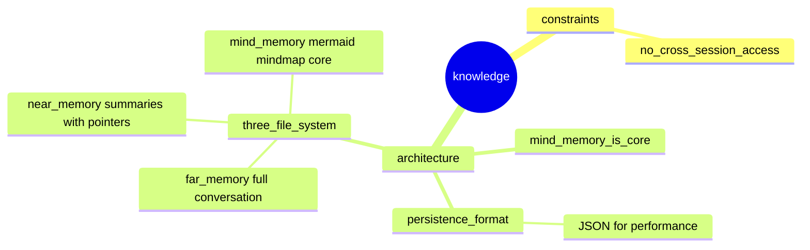

```mermaid
mindmap
  root((knowledge))
    constraints
      no_cross_session_access
    architecture
      persistence_format
        JSON for performance
      three_file_system
        far_memory full conversation
        near_memory summaries with pointers
        mind_memory mermaid mindmap core
      mind_memory_is_core
```
