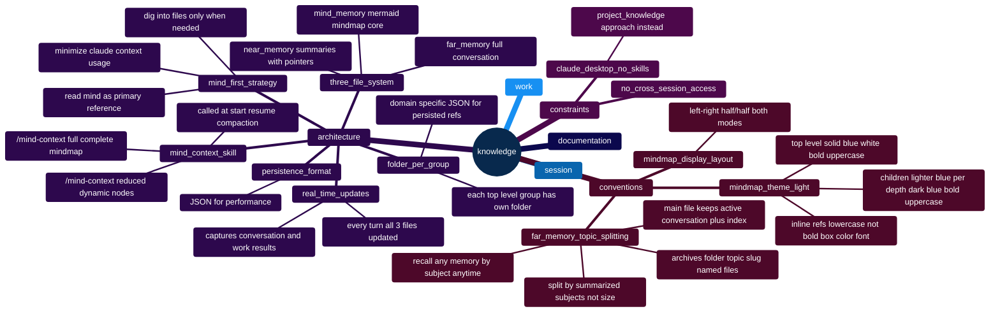

```mermaid
%%{init: {'theme': 'base', 'themeVariables': { 'primaryColor': '#1565C0', 'primaryTextColor': '#FFFFFF', 'primaryBorderColor': '#0D47A1', 'secondaryColor': '#42A5F5', 'secondaryTextColor': '#0D47A1', 'tertiaryColor': '#90CAF9', 'tertiaryTextColor': '#0D47A1', 'noteBkgColor': '#BBDEFB', 'noteTextColor': '#0D47A1' }}}%%
mindmap
  root((knowledge))
    session
    work
    documentation
    architecture
      persistence_format
        JSON for performance
      three_file_system
        far_memory full conversation
        near_memory summaries with pointers
        mind_memory mermaid mindmap core
      mind_first_strategy
        read mind as primary reference
        dig into files only when needed
        minimize claude context usage
      real_time_updates
        every turn all 3 files updated
        captures conversation and work results
      folder_per_group
        each top level group has own folder
        domain specific JSON for persisted refs
      mind_context_skill
        /mind-context reduced dynamic nodes
        /mind-context full complete mindmap
        called at start resume compaction
    constraints
      no_cross_session_access
      claude_desktop_no_skills
        project_knowledge approach instead
    conventions
      mindmap_display_layout
        left-right half/half both modes
      mindmap_theme_light
        top level solid blue white bold uppercase
        children lighter blue per depth dark blue bold uppercase
        inline refs lowercase not bold box color font
      far_memory_topic_splitting
        split by summarized subjects not size
        archives folder topic slug named files
        main file keeps active conversation plus index
        recall any memory by subject anytime
```
