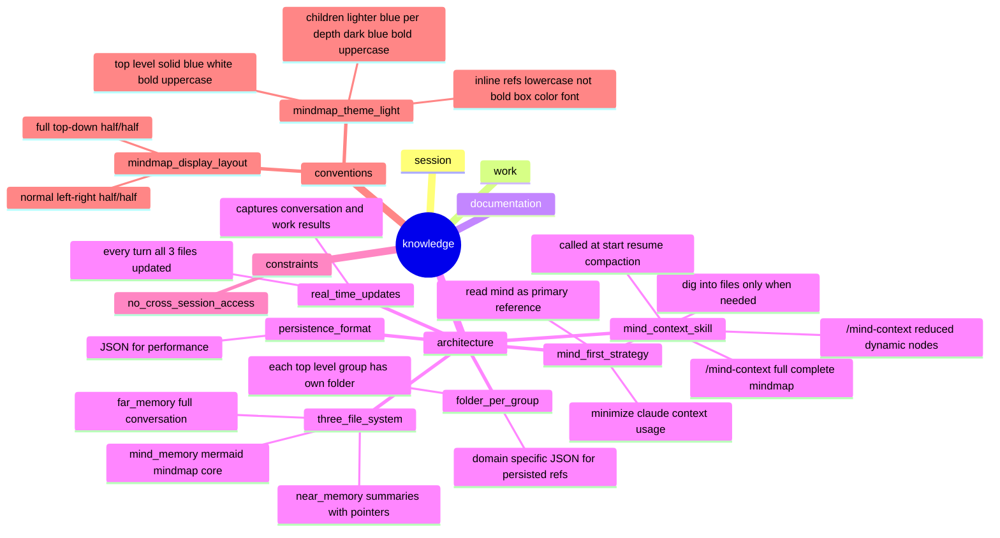

```mermaid
mindmap
  root((knowledge))
    session
    work
    documentation
    architecture
      persistence_format
        JSON for performance
      three_file_system
        far_memory full conversation
        near_memory summaries with pointers
        mind_memory mermaid mindmap core
      mind_first_strategy
        read mind as primary reference
        dig into files only when needed
        minimize claude context usage
      real_time_updates
        every turn all 3 files updated
        captures conversation and work results
      folder_per_group
        each top level group has own folder
        domain specific JSON for persisted refs
      mind_context_skill
        /mind-context reduced dynamic nodes
        /mind-context full complete mindmap
        called at start resume compaction
    constraints
      no_cross_session_access
    conventions
      mindmap_display_layout
        full top-down half/half
        normal left-right half/half
      mindmap_theme_light
        top level solid blue white bold uppercase
        children lighter blue per depth dark blue bold uppercase
        inline refs lowercase not bold box color font
```
