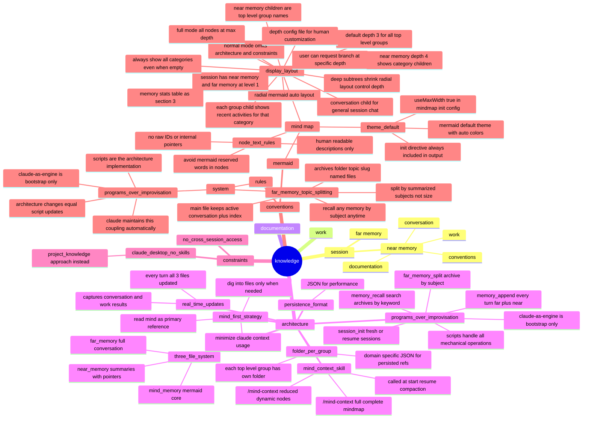

```mermaid
%%{init: {'theme': 'default', 'mindmap': {'useMaxWidth': true}}}%%
mindmap
  root((knowledge))
    session
      near memory
        conversation
        conventions
        work
        documentation
      far memory
    work
    documentation
    architecture
      persistence_format
        JSON for performance
      three_file_system
        far_memory full conversation
        near_memory summaries with pointers
        mind_memory mermaid core
      mind_first_strategy
        read mind as primary reference
        dig into files only when needed
        minimize claude context usage
      real_time_updates
        every turn all 3 files updated
        captures conversation and work results
      folder_per_group
        each top level group has own folder
        domain specific JSON for persisted refs
      mind_context_skill
        /mind-context reduced dynamic nodes
        /mind-context full complete mindmap
        called at start resume compaction
      programs_over_improvisation
        claude-as-engine is bootstrap only
        scripts handle all mechanical operations
        memory_append every turn far plus near
        far_memory_split archive by subject
        memory_recall search archives by keyword
        session_init fresh or resume sessions
    constraints
      no_cross_session_access
      claude_desktop_no_skills
        project_knowledge approach instead
    conventions
      rules
        system
          programs_over_improvisation
            claude-as-engine is bootstrap only
            scripts are the architecture implementation
            architecture changes equal script updates
            claude maintains this coupling automatically
          far_memory_topic_splitting
            split by summarized subjects not size
            archives folder topic slug named files
            main file keeps active conversation plus index
            recall any memory by subject anytime
      mermaid
        mind map
          display_layout
            radial mermaid auto layout
            default depth 3 for all top level groups
            normal mode omits architecture and constraints
            deep subtrees shrink radial layout control depth
            full mode all nodes at max depth
            depth config file for human customization
            user can request branch at specific depth
            session has near memory and far memory at level 1
            near memory depth 4 shows category children
            near memory children are top level group names
            each group child shows recent activities for that category
            conversation child for general session chat
            always show all categories even when empty
            memory stats table as section 3
          theme_default
            mermaid default theme with auto colors
            init directive always included in output
            useMaxWidth true in mindmap init config
          node_text_rules
            human readable descriptions only
            no raw IDs or internal pointers
            avoid mermaid reserved words in nodes
```
